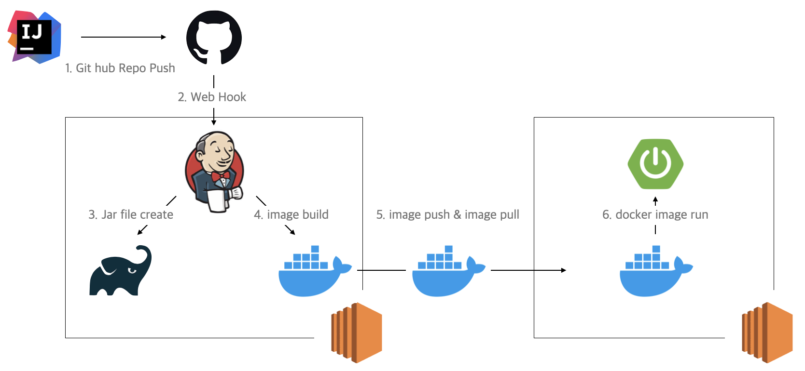

# Jenkins 구축기

0. 목차
1. CI/CD
2. Jenkins 구축
    1. 구축 전
    2. 구축
    3. 구축 후
3. 회고

--------------------------

## 1. CI/CD
> SW 개발 라이프 사이클 간소화 및 가속화  
>
### CICD 
- CI(Continuous Integration, 지속적 통합)
  - 애플리케이션의 새로운 코드 변경사항을 정기적으로 빌드 및 테스트되어 공유 레포지토리에 통합되는 것
  - 새로운 소스코드의 빌드, 테스트, 병합
  - 다수의 개발자가 형성관리 툴을 공유하여 사용하는 환경
- CD(Continuous Delivery/Deployment, 지속적 제공-배포)
  - Continuos Delivery : 공유 레포지토리로 자동 릴리즈 하는 것
  - Continuos Deploy : 변경사항을 레포지토리 이후의 프로덕션 환경까지 릴리즈 하는 것
  - 변경사항을 빠르게 고객에게 전달
- 꼭 해야할까
  - 장점 
    - MSA/Agile 
    - 신뢰가능한 소프트웨어
    - 빠른 버그 fix
    - 릴리즈의 시간 단축
    - 반복적인 업무 간소화
    - CI-CD 과정에서의 알림 추가 또는 빌드 데이터, 버전 관리 등 데이터 수집 및 시각화 가능
  - 단점 
    - 학습 비용
    - 관리 포인트 증가
    - 서버 비용 증가
    - tool 비용 (optional)
- tool
  - jenkins, Bamboo, circleCI, TeamCity, GitHub Actions, AWS CodeDeploy 

------
## 2. Jenkins
### 구축 전
- 클라우드 환경 젠킨스 + 온프레미스 환경 애플리케이션 배포 경험 있음
- 클라우드 환경과 docker로 어떻게 구축해야 할까?  
- 설정파일은 어떻게 해야할까 

### 구축

1. 구상한 파이프라인 
   1. 로컬 코드를 레포지토리에 push
   2. git에서 push를 감지하면 젠킨스로 CICD 요청을 보냄
   3. 빌드 준비 및 빌드 시작
   4. 만들어진 jar파일을 도커 이미지로 빌드 
   5. 도커 허브에 push, 원격 서버에서 도커 pull
   6. 이미지 run 
    

2. 부딪힌 문제들
   - 도커로 띄워진 젠킨스 내에서 도커 사용하기
     - DinD, DooD
     - DinD(Docker in Docker) : 호스트 도커 컨테이너 내부에서 새로운 도커를 실행시키는 것
     - DooD(Docker Out Of Docker) : 호스트 도커 데몬의 소켓을 공유해서 도커클라이언트 컨테이너에서 컨테이너를 실행
   - 생각보다 큰 Jenkins 용량
   - application.properties?
     - 젠킨스에 SECRET 파일 또는 변수로 등록
     - 원격 서버에서 외부주입
   - 파이프라인 프로젝트 vs 프리스타일 프로젝트
     - 진입장벽 비교적 낮음, 커스터마이징 제한적 (프리스타일)
     - groovy 문법 기반 
### 구축 후 
- 도커는 빌드 속도 향상을 위해 캐시를 사용하는데, 서버 용량관련해서 자주 에러가 생김..*
- 생각보다 젠킨스를 통한 배포가 속도가 오래 걸림, 개선? 

-----

## 3. 회고
1. 생각보다 신경써야할 부분들이 많다
- credential, ssh ...
- shell script
- Roll Back 전략
- 무중단 배포

2. Github Action, CodeDeploy ?
- 젠킨스보다 상대적으로 쉬운 초기설정
- ...