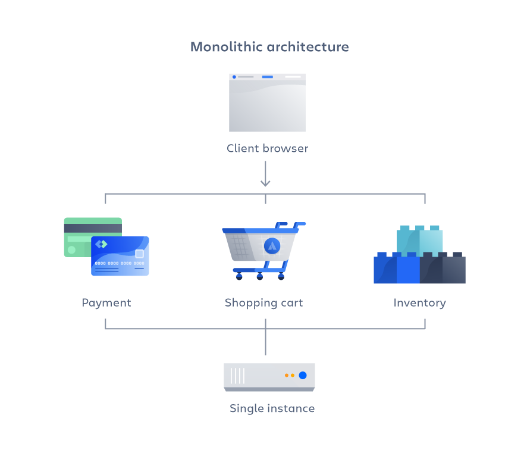
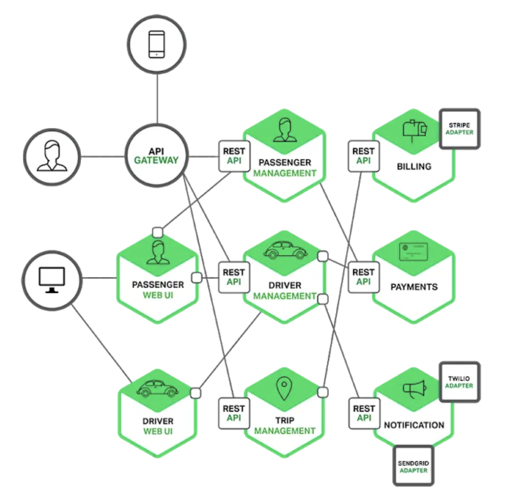
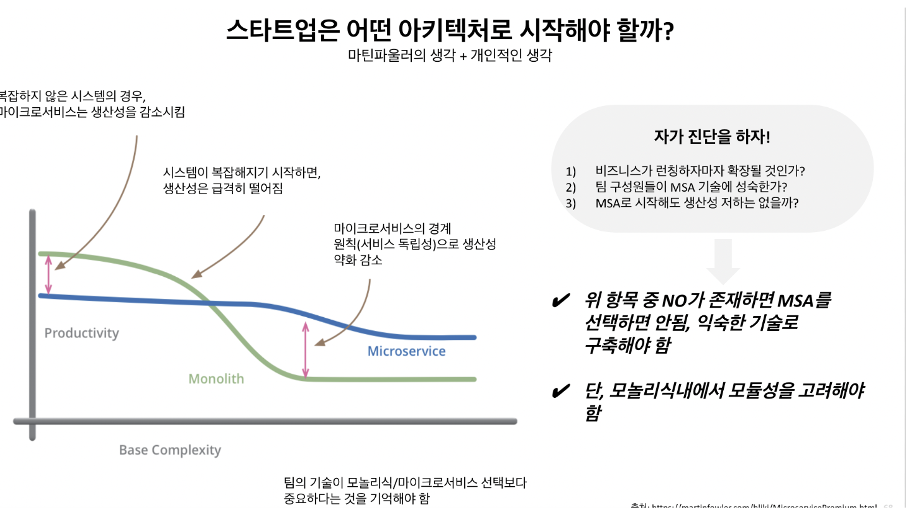

# Monolithic 과 Microservice 아키텍처의 개념과 차이점

## Monolithic 아키텍처

### 개념

 

monolithic 은 '하나로 된' 이라는 뜻으로, 모놀리식 아키텍처는 말 그대로 하나의 코드 안에 시스템의 모든 기능이 들어가 있는 구조를 말한다.

예를 들어, 토스와 같은 금융 어플리케이션을 모놀리식 아키텍처로 구성한다고 가정해보자. 

토스에는 결제, 송금, 주식 등 많은 서비스들이 있다. 
모놀리식 아키텍처는 이러한 서비스들이 하나의 코드 베이스에서 작업되는 것이다. 

또한, 이런 하나하나의 서비스들의 UI (Frontend), 비즈니스 로직(Backend), 데이터베이스(DB) 도 하나의 공간에서 작업하는 것이 모놀리식 아키텍처이다.

이런 모놀리식 아키텍처는 개발자들 사이에서 가장 일반적인 작업 방식이다. 

 

`그렇다면 어떤 장점이 있어서 개발자들은 모놀리식 아키텍처를 선택했을까?`

- **단순성** : 모든 코드가 단일 코드 베이스에 있다. 변경 사항이 발생할 경우 필요한 모든 코드가 한곳에 존재한다. 어플리케이션을 로컬에서 실행해야 할 경우 단일 어플리케이션만 실행하면 된다.

- 간편한 배포 : 단일 프로젝트로 배포하면 되기 때문에 간편하다. 새로운 기능이 추가되거나 버그가 수정될 때마다 단일 어플리케이션을 배포하면 된다.

- 보편성 : 대부분의 개발자가 모놀리식 아키텍처에서 작업한 경험이 있어, 프로젝트를 쉽게 시작할 수 있다.

- **쉬운 디버깅** : 모든 코드가 단일 어플리케이션에 있기 때문에 디버깅이 쉽다. 

- **쉬운 테스트와 모니터링** : 모든 코드가 단일 어플리케이션에 있어 해당 어플리케이션만 테스트하고 오류 시에도 문제를 식별하기 쉽다.

 

`어떤 단점이 있길래 모놀리식에서 마이크로서비스 아키텍처로의 전환을 하는걸까?`

- **느린 개발 속도** : 대규모 모놀리식 어플리케이션에서는 개발이 더욱 복잡해지고 속도가 느려진다.
  > 최근 서비스들은 빠른 시장 변화에 대응하기 위해 점점 빠른 주기로 기능을 추가하고 수정하고 있다. 

- **규모가 커지면 유지 보수가 어려움** : 시간이 지남에 따라 어플리케이션이 커지면 관리가 어려울 수 있다. 모놀리식 어플리케이션은 중소형 어플리케이션에선 잘 작동하지만, 어플리케이션이 크고 복잡해지면 문제가 발생할 수 있다.
  > 규모가 너무 커지면 전체적인 코드를 분석하기 어렵고 작업의 영향을 파악하기 어렵다.

- **안정성** : 모듈에 오류가 있으면 어플리케이션 전체의 가용성에 영향을 줄 수 있다.
  > 예를 들면, 토스 서비스 내에서 결제 서비스에서 문제가 생겼는데 전체 서비스가 동작하지 않을 수 있다.

- 대규모 팀 작업이 어려움 : 모든 팀이 동일한 코드, 동일한 프로젝트에서 작업하기 때문에 코드 병합에 대한 충돌 가능성이 높고, 기능 변경 시 다른 팀의 작업에 영향을 줄 수 있다.

- **기술 사용 제한** : 모놀리식 어플리케이션을 다른 기술로 변경하는 것은 어렵기 때문에, 오랜 기간 동일한 기술을 사용해야 한다.
  > 예를 들면, mybatis 나 jquery 같은 오래된 기술을 교체하기 어렵다

- **배포** : 모놀리식 어플리케이션을 약간만 변경하는 경우에도 전체 모놀리스를 다시 배포해야한다.
  > 코드 한 줄만 바꾸더라도 배포에 30분 이상 소요되는 어플리케이션을 재배포해야 변경점을 반영할 수 있다.

- 유연하지 않은 확장성 : 모놀리식도 확장할 수 있지만 전체 어플리케이션의 확장만 가능하다. 
  > 예를 들어, 어플리케이션의 특정 부분에 대해 요청을 받으면, 해당 부분만 확장할 수는 없고 전체 어플리케이션을 확장해야 한다.

 

## Microservice 아키텍처

### 개념

 

> 마이크로서비스 아키텍처 정의 (구글 클라우드)
> 
> 마이크로서비스 아키텍처는 어플리케이션이 서비스 모음으로 개발되는 어플리케이션 아키텍처의 한 유형입니다. 또한 마이크로서비스 아키텍처 다이어그램과 서비스를 독립적으로 개발, 배포, 유지관리할 수 있는 프레임워크를 제공합니다.

 

앞서 모놀리식 아키텍처를 설명할 때 들었던 토스로 예시를 들어보자. 모놀리식 아키텍처에서는 토스의 송금, 결제, 주식, 환전 등의 시스템이 하나의 코드 베이스에서 실행이 되었다.

반면 마이크로서비스 아키텍처에서는 송금, 결제, 주식, 환전 등의 서비스를 각 코드 베이스에서 각각 실행시켜야 하는 것이다.

 

하나의 코드 베이스 실행한다는 것을 조금 풀어서 설명해보자. 

기존에 어떤 서비스를 만든다고 하면 깃허브 Repository 를 생성하고 거기에 하나의 어플리케이션을 만들어서 AWS 에 배포를 하면 서비스를 런칭할 수 있다.

마이크로서비스로 여러 코드 베이스에서 실행한다는 것은 깃허브, 어플리케이션 세팅, 배포 환경 세팅, 테스트 환경 등 이러한 일련의 과정을 서비스마다 세팅해줘야 한다는 것을 의미한다. 

 

`전환을 이끈 마이크로서비스 아키텍처의 장점`

- 유연한 확장 : 각 마이크로서비스는 다른 서비스와 독립적으로 확장할 수 있다.
  > 예를 들어, 어플리케이션의 일부가 요청을 받을 경우, 전체 어플리케이션을 확장하는 대신 특정 마이크로서비스만 확장할 수 있기에 어플리케이션의 고가용성이 필요할 때 매우 유용하다.

- **독립적인 배포** : 마이크로서비스는 느슨하게 결합되어 있으므로 하나의 서비스만 배포할 수 있다. 이렇게 하면 어플리케이션의 작은 부분만 업데이트되므로 전체 어플리케이션의 작동을 멈출 필요가 없다.

- **전체 서비스 중단 위험 감소** : 특정 마이크로서비스가 중단되더라도 전체 어플리케이션에 영향을 미치지 않는다. 즉 다른 마이크로서비스는 정상적으로 작동한다.

- **다른 데이터베이스를 소유** : 각 마이크로서비스별로 데이터베이스를 소유할 수 있다. 
  >어떤 서비스에서는 관계형이 적합할 수 있고 NoSQL 이 적합할 수 있다. 각 서비스에 맞는 데이터베이스를 선택할 수 있다.

- **다양한 기술 수용 가능** : 각 마이크로서비스는 서로 다른 기술을 가질 수 있다. 
  > 웹에는 Java, AI 서비스에는 python 등 서로 다른 기술을 채택할 수 있다.

- 민첩성 : 마이크로서비스 아키텍처를 사용하면 전체 어플리케이션에 큰 영향을 주지 않고, 새로운 것을 추가할 수 있어 새 버전을 배포하는 것이 매우 쉽다.

 

`그렇다면 마이크로서비스로 모든 서비스가 전환해야하는가? 마이크로서비스 아키텍처의 단점`

- **개발 생산성 필요** : 여러 개의 마이크로서비스 중 하나에 새로운 기능을 구현해야 할 때, 다른 서비스에 접근할 수 있도록 로컬에서 많은 어플리케이션을 실행할 수 있는 환경을 갖춰야 한다.
  > 여러 서비스를 작업하기 위해 도커, 쿠버네티스를 통해 환경을 구축해야하고, 이를 위한 기술 난이도가 높다.

- **디버깅 및 테스트 난이도 증가** : 디버깅하거나 테스트를 위해 둘 이상의 마이크로서비스를 실행해야 한다. 각 서비스를 모두 보면서 디버깅 및 테스트를 진행해야 한다.

- **마이크로서비스 간 통신** : 동기/비동기 방식의 통신을 고려해야 하며, 이런 부분이 어플리케이션의 복잡성을 증가시킨다.
  > 하나의 서비스에서 API 스펙이 변경되었으면, 통신하고 있는 모든 곳에서 수정이 이뤄져야 한다.

- 오류 처리 : 두 개 이상의 마이크로서비스를 사용해 요청을 처리한다면, 첫 번째 서비스에 대한 요청에서 문제 발생 시 작업을 이전 상태로 되돌릴 수 있도록 작업해야 한다.

- 표준화 부족 : 공통 플랫폼이 없어 여러 언어, 로깅 표준 및 모니터링이 사용될 수 있다. 마이크로서비스에서 발생하는 모든 오류 또는 문제를 모니터링할 수 있는 중앙 모니터링 체계를 갖추는 것이 필요하다.

- **수많은 협업의 어려움** : 결제 서비스를 개발하는 개발자는 결제 서비스 뿐만 아니라 통신하는 다른 서비스도 알아야 하며 다른 서비스의 개발자, 기획자와 소통하며 개발해야 한다.
  > 하나의 서비스 내에서도 소통이 어려운데, 타 서비스와 협업하는 것은 상상보다 더 어려울 수 있다.

## 어떻게 하면 마이크로서비스 아키텍처로 '잘' 전환할 수 있을까?

`마이크로서비스 아키텍처로의 전환을 고려할 때는 언제인가?`

마이크로서비스 아키텍처는 최근 기술 트렌드의 핵심 단어이다. 그와 함께 클라우드 시장이 급부상하였고 모두가 가야하는 방향처럼 느껴질 수 있다.

하지만 마이크로서비스 아키텍처는 정답이 아니며, 도입을 위해서는 많은 고민과 노력이 필요하다.

마이크로서비스 아키텍처의 도입을 고려할 때 다음과 같은 특징을 고려하면 좋다.

 

 

- 어플리케이션이 크고 복잡해질 가능성이 높은가?
  > 복잡한 것보다는 당연히 단순한게 좋다. 모놀리식 아키텍처에서는 각 서비스, 기능들이 강하게 결합되어 있다.  
  > 강하게 결합되어 있다는 것은 기능개발을 할 때 각 서비스의 영향에 대해 고려해야 한다는 것을 의미한다. 뿐만 아니라 테스트를 진행할 때에도 전체 서비스에 대해서도 테스트를 해야한다.  
  > 자연스럽게 팀의 생산성은 내려간다. 너무 어플리케이션이 복잡해 생산성이 내려간다면 아키텍처 전환을 고려하자.
- 우리 팀은 도메인에 대해 잘 알고 있는가?
- 가용성(정상적으로 시스템이 동작하는 정도)을 갖춰야 하는가?
  > 프로그램은 당연히 가용성이 높을수록 좋고 높아야 한다! 잦은 시스템 오류는 이용자의 이탈로 이어진다.  
  > 시스템의 오류를 찾고 수정하고 배포하는데 시간이 너무 많이 든다면 서비스를 분산하여 관리하는게 효과적일 수 있다.
- 확장성을 갖춰야 하는가?
- 마이크로서비스에 대한 경험이 있는가?

### 참고
> [인프콘 - 모놀리식 vs 마이크로서비스 아키텍처, 우리 팀에 맞는 선택은?](https://www.inflearn.com/pages/infcon-2023-tech-msa)
> 
> [Atlassian - 모놀리식 vs 마이크로서비스 아키텍처](https://www.atlassian.com/ko/microservices/microservices-architecture/microservices-vs-monolith)
> 
> [Atlassian - 마이크로서비스를 구축하는 법](https://www.atlassian.com/ko/microservices/microservices-architecture/building-microservices)
> 
> [MSA 아키텍처로의 전환 사례 - 쿠팡](https://medium.com/coupang-engineering/how-coupang-built-a-microservice-architecture-fd584fff7f2b)
> 
> [요즘IT - 모놀리식 vs 마이크로서비, 어떤 아키텍처를 선택할까?](https://yozm.wishket.com/magazine/detail/1813/)
> 
> [삼성 SDS - 마이크로서비스 아키텍처가 꼭 필요한가요?](https://www.samsungsds.com/kr/insights/msa.html)
> 
