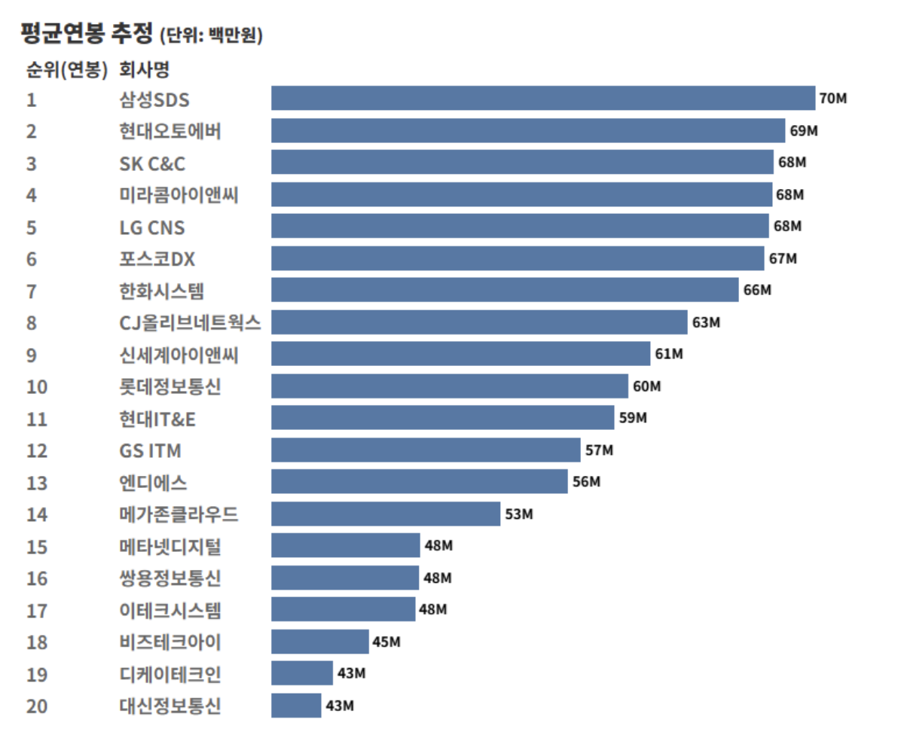

# SI 와 Saas 서비스

SI 란 무엇인가?

우선 SI 는 `System Integration` 의 약자로 시스템 통합이라는 의미를 가지고 있습니다.

시스템 통합이라는 용어는 네트워크, 하드웨어, 소프트웨어 등을 합쳐서 `하나의 서비스`로 운영될 수 있도록 하는 사업을 말합니다.

우리나라의 대표적인 SI 기업으로는 삼성SDS, LG CNS, SK C&C 등이 있습니다.

SI 를 큰 범주로 바라보면 IT 서비스라는 카테고리의 비즈니스로 정의할 수 있다. 그렇다면 IT 서비스는 어떤 것까지를 포괄하는 개념일까?

> 한국 IT 서비스 협회에서 정의한 내용에 따르면 “고객 맞춤형 컨설팅부터 시스템 구축(SI), 운영(SM), IT 시스템 교육까지, 정보시스템화의 필요한 모든 제반 활동을 지원하기 위해 전문인력과 기업을 성장. 육성시키는 비즈니스
>

SI 가 어떤 일을 하는지 생각할 때 반대의 개념과 같이 살펴보면 이해하기 편하다.

SI 는 수주형 사업을 하고, 반대는 독립형 사업을 한다고 정리해보자.

`수주형 사업`이란 다른회사로부터 개발의뢰를 받는 경우를 말합니다. 고객사에서 필요한 서비스에 대한 가격을 책정해두고 공고를 올려 SI 업체들이 공고에 입찰하여 프로젝트를 수주하여 개발하는 것이다.

`독립형 사업`이란 남의 의뢰를 받지 않고 내가 생각한 제품을 만들어 파는 것을 말한다. 해당 비즈니스를 하는 기업은 우리가 흔히 아는 네카라쿠배당토가 해당 형태로 비즈니스를 하고 있다.

### 참고 자료

[SI 회사는 가면 안되나요? | 요즘 IT](https://yozm.wishket.com/magazine/detail/2407/)
 
[SI 기업 TOP 20 을 알아보자 | 요즘 IT](https://yozm.wishket.com/magazine/detail/2432/)