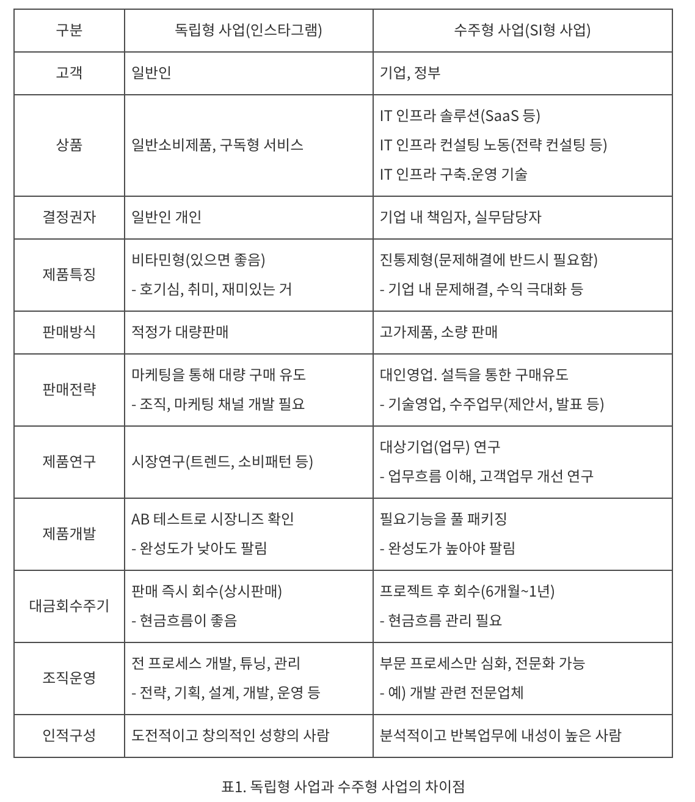

# SI 와 Saas 서비스

### SI 란 무엇인가?

우선 SI 는 `System Integration` 의 약자로 시스템 통합이라는 의미를 가지고 있습니다.

시스템 통합이라는 용어는 네트워크, 하드웨어, 소프트웨어 등을 합쳐서 `하나의 서비스`로 운영될 수 있도록 하는 사업을 말합니다.

우리나라의 대표적인 SI 기업으로는 삼성SDS, LG CNS, SK C&C 등이 있습니다.

SI 를 큰 범주로 바라보면 IT 서비스라는 카테고리의 비즈니스로 정의할 수 있습니다. 그렇다면 IT 서비스는 어떤 것까지를 포괄하는 개념일까?

> 한국 IT 서비스 협회에서 정의한 내용에 따르면 “고객 맞춤형 컨설팅부터 시스템 구축(SI), 운영(SM), IT 시스템 교육까지, 정보시스템화의 필요한 모든 제반 활동을 지원하기 위해 전문인력과 기업을 성장. 육성시키는 비즈니스
>

SI 가 어떤 일을 하는지 생각할 때 반대의 개념과 같이 살펴보면 이해하기 편하다.

SI 는 수주형 사업을 하고, 반대는 독립형 사업을 한다고 정리해보자.

`수주형 사업`이란 다른회사로부터 개발의뢰를 받는 경우를 말합니다. 고객사에서 필요한 서비스에 대한 가격을 책정해두고 공고를 올려 SI 업체들이 공고에 입찰하여 프로젝트를 수주하여 개발하는 것이다.

`독립형 사업`이란 남의 의뢰를 받지 않고 내가 생각한 제품을 만들어 파는 것을 말한다. 해당 비즈니스를 하는 기업은 우리가 흔히 아는 네카라쿠배당토가 해당 형태로 비즈니스를 하고 있다.

**그럼 독립형 사업과 수주형 사업은 어떻게 다를까?**

독립형 사업을 하는 사업은 우리 같은 일반인을 대상으로 비즈니스를 전개하는 B2C 사업자, 수주형 사업을 하는 사업은 기업이나 정부를 대상으로 비즈니스를 전개하는 B2B 사업자로 볼 수 있다.

SI 는 기본적으로 기업의 니즈를 충족시키는 비즈니스이다. 삼성전자나 SK하이닉스 같은 제조업 기업은 본업이 반도체를 만드는 기업이다. 하지만 부수적으로 재무에 대한 업무, 마케팅 업무 등 부수적인 작업들이 생긴다.

이런 부수적인 업무를 위해서 자체 시스템을 개발하려고 하면 개발자를 따로 채용해야 하고 시스템을 기획하고 많은 자원이 투입된다. 그래서 이러한 작업을 외부에 위탁하는데 이런 일을 맡아서 하는 비즈니스가 SI, 시스템 구축사업이다.

### SI 비즈니스 모델

그렇다면 SaaS 서비스는 어떤 것인가? SaaS 는 SI 비즈니스의 한 모델을 말한다. SI 사업에는 On-Premise, IaaS, PaaS, SaaS 등의 사업 모델이 있다.

각각의 모델에 대해서 살펴보자. 

### On-premise 

On-premise 모델 IT 시스템과 소프트웨어를 자체적인 물리적인 공간에 직접 설치하고 운영하는 모델을 말한다.

자체적으로 서버실이 존재하고 서버실에 소프트웨어를 설치하고 운영한다. 데이터도 자체적으로 보유하고 관리한다. 즉, 데이터가 많아지면 추가로 스토리지를 구매해야하고 성능 이슈가 발생하면 하드웨어를 직접 교체해야 한다. 

`그렇다면 SI 업체는 해당 모델로 비즈니스를 어떻게 전개하는가?`

기본적으로 수주받은 소프트웨어를 개발하고 소프트웨어에 대한 사용 방법을 기업에 전해주고 사업팀은 철수한다. 소프트웨어를 운영하는 니즈 (오류 수정, 신규 기능 추가 등) 가 생기는 데 이러한 업무를 SM (Service Management) 라고 한다. 고객사에 대한 신뢰를 유지하기 위해 고객사에 상주하는 SM 팀을 운영하기도 한다.

`그럼 어떤 비즈니스가 On-premise 모델에 대한 니즈가 있을까?`

예를 들어, 급여나 인사 정보 등 기업의 민감한 사항들을 다루는 시스템과 같은 경우는 타 기업에 위탁하기가 어렵습니다. 때문에 기업의 민감한 정보를 다루는 비즈니스는 On-premise 방식으로 구축하여 해당 기업이 관리하려는 니즈가 강합니다.

최근 chatGPT 의 유행으로 많은 사람들이 자신들의 업무에 대한 질문을 chatGPT 에게 하는데 chatGPT 는 사용자가 입력받은 정보를 자체적인 서버가 받아서 처리하는 방식이기 때문에 정보 유출 우려로 기업들이 사용을 금지하도록 한 사례가 있습니다. 

[기업들의 chatGPT 금지 사례](https://www.digitaltoday.co.kr/news/articleView.html?idxno=477078)

**On-premise 모델의 장점과 단점**

| 장점             | 설명                                                                                     |
|----------------|----------------------------------------------------------------------------------------|
| 보안            | 자체 데이터 센터를 운영하여 보안 요구 사항을 엄격하게 준수할 수 있습니다.                              |
| 제어            | 모든 하드웨어, 소프트웨어 및 네트워크 구성 요소를 직접 관리하여 필요에 따라 조정할 수 있습니다.                  |
| 커스터마이제이션    | 조직의 고유한 요구 사항에 맞게 솔루션을 맞춤 설정할 수 있습니다.                                   |
| 성능            | 일부 응용 프로그램 및 워크로드는 온프레미스 환경에서 더 나은 성능을 제공할 수 있습니다.                        |

| 단점             | 설명                                                                                     |
|----------------|----------------------------------------------------------------------------------------|
| 비용            | 하드웨어, 소프트웨어 라이선스, 유지 보수 및 인력에 대한 비용이 상당할 수 있습니다.                           |
| 유연성 부족       | 클라우드와는 달리 자원의 확장이나 축소가 더 어려울 수 있습니다.                                     |
| 관리 부담        | 모든 것을 직접 관리해야 하므로 인력 및 시간이 많이 필요합니다.                                      |
| 장애 복구 및 비상 대응 | 장애 복구 및 비상 대응 계획을 구축하고 유지 관리해야 합니다.                                      |

### 참고 자료

>[SI 회사는 가면 안되나요? | 요즘 IT](https://yozm.wishket.com/magazine/detail/2407/)
> 
>[스타트업, SI를 해도 되나요? | 요즘 IT](https://yozm.wishket.com/magazine/detail/2424/)
> 
>[갑은 SI 프로젝트를 어떻게 만들까? | 요즘 IT](https://yozm.wishket.com/magazine/detail/2448/)
> 
>[SI 기업 TOP 20 을 알아보자 | 요즘 IT](https://yozm.wishket.com/magazine/detail/2432/)
>
>[SaaS 란 - RedHat](https://www.redhat.com/ko/topics/cloud-computing/what-is-saas)