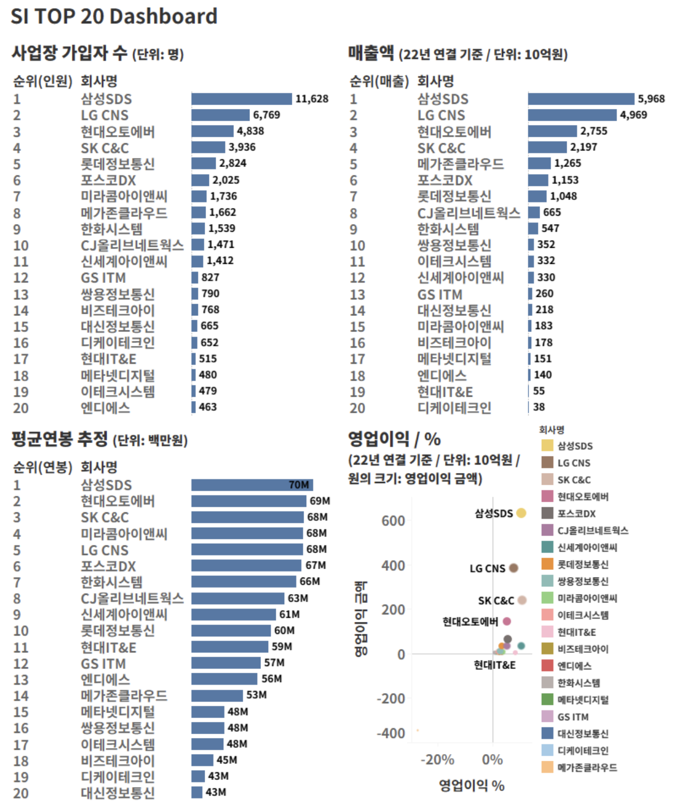
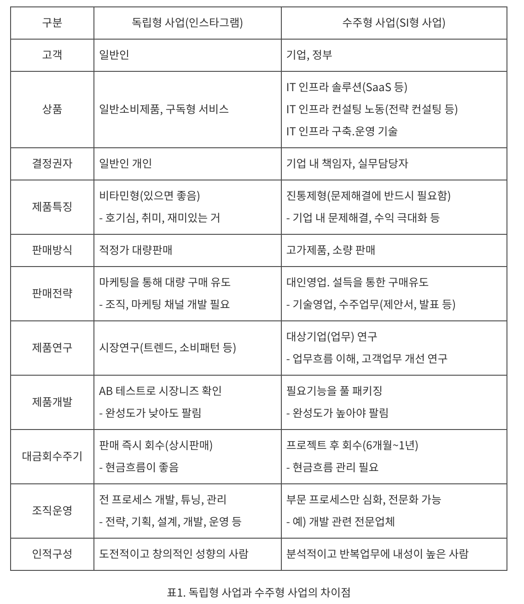

# SI 와 Saas 서비스

### SI 란 무엇인가?

우선 SI 는 `System Integration` 의 약자로 시스템 통합이라는 의미를 가지고 있다.

시스템 통합이라는 용어는 네트워크, 하드웨어, 소프트웨어 등을 합쳐서 `하나의 서비스`로 운영될 수 있도록 하는 사업을 말한다.

우리나라의 대표적인 SI 기업으로는 삼성SDS, LG CNS, SK C&C 등이 있다.

SI 를 큰 범주로 바라보면 IT 서비스라는 카테고리의 비즈니스로 정의할 수 있다. 그렇다면 IT 서비스는 어떤 것까지를 포괄하는 개념일까?

> 한국 IT 서비스 협회에서 정의한 내용에 따르면 “고객 맞춤형 컨설팅부터 시스템 구축(SI), 운영(SM), IT 시스템 교육까지, 정보시스템화의 필요한 모든 제반 활동을 지원하기 위해 전문인력과 기업을 성장. 육성시키는 비즈니스
>

SI 가 어떤 일을 하는지 생각할 때 반대의 개념과 같이 살펴보면 이해하기 편하다.

SI 는 수주형 사업을 하고, 반대는 독립형 사업을 한다고 정리해보자.

`수주형 사업`이란 다른회사로부터 개발의뢰를 받는 경우를 말한다. 고객사에서 필요한 서비스에 대한 가격을 책정해두고 공고를 올려 SI 업체들이 공고에 입찰하여 프로젝트를 수주하여 개발하는 것이다.

`독립형 사업`이란 남의 의뢰를 받지 않고 내가 생각한 제품을 만들어 파는 것을 말한다. 해당 비즈니스를 하는 기업은 우리가 흔히 아는 네카라쿠배당토가 해당 형태로 비즈니스를 하고 있다.

`그럼 독립형 사업과 수주형 사업은 어떻게 다를까?`

독립형 사업을 하는 사업은 우리 같은 일반인을 대상으로 비즈니스를 전개하는 B2C 사업자, 수주형 사업을 하는 사업은 기업이나 정부를 대상으로 비즈니스를 전개하는 B2B 사업자로 볼 수 있다.

SI 는 기본적으로 기업의 니즈를 충족시키는 비즈니스이다. 삼성전자나 SK 하이닉스 같은 제조업 기업은 본업이 반도체를 만드는 기업이다. 하지만 부수적으로 재무에 대한 업무, 마케팅 업무 등 부수적인 작업들이 생긴다.

이런 부수적인 업무를 위해서 자체 시스템을 개발하려고 하면 개발자를 따로 채용해야 하고 시스템을 기획하고 많은 자원이 투입된다. 그래서 이러한 작업을 외부에 위탁하는데 이런 일을 맡아서 하는 비즈니스가 SI, 시스템 구축사업이다.

`그럼 초기 시스템 구축의 방식은 어땠을까?`

각 기업이 PC 를 구입하고 데이터를 PC 에 저장하고 관리하는 방향으로 시스템을 구축하고자 했다. 이러한 방식을 On-Premise 방식이라고 한다. 

### On-premise

>"온프레미스(On-Premise)"는 기업이나 조직이 자체적으로 IT 인프라 및 소프트웨어를 구축하고 운영하는 것을 의미한다. 즉, 온프레미스 솔루션은 조직의 데이터 센터나 로컬 서버에서 설치되고 관리된다.

**On-premise 방식의 등장 배경**

- `기업의 IT 필요성 증가`: 기업이나 조직은 정보 기술의 발전으로 인해 점점 더 많은 IT 시스템을 필요로 하게 되었다. 이에 따라 온프레미스 비즈니스는 이러한 IT 인프라 구축과 관리에 대한 수요를 충족시키기 위해 등장했다.

- `비즈니스 운영의 복잡성 증가`: 기업의 비즈니스 운영이 점점 더 복잡해지면서, 이를 지원하기 위한 다양한 IT 시스템이 필요하게 되었다. 이러한 IT 시스템들을 효율적으로 통합하고 관리하기 위해 SI 비즈니스가 필요해졌다.

- `기업의 효율성과 경쟁력 강화`: IT 시스템을 효율적으로 운영하고 유지보수하는 것은 기업의 경쟁력을 강화하는 데 중요한 요소이다. 온프레미스 비즈니스는 이를 돕기 위해 IT 시스템의 설계, 구축, 유지보수 등을 담당한다.

`SI 비즈니스를 하는 기업들의 On-premise 방식으로 일하는 플로우는 어떻게 될까?`

기본적으로 수주받은 소프트웨어를 개발하고 소프트웨어에 대한 사용 방법을 기업에 전해주고 사업팀은 철수한다. 소프트웨어를 운영하는 니즈 (오류 수정, 신규 기능 추가 등) 가 생기는 데 이러한 업무를 SM (Service Management) 라고 한다. 고객사에 대한 신뢰를 유지하기 위해 고객사에 상주하는 SM 팀을 운영하기도 한다.

`그럼 어떤 비즈니스가 On-premise 모델에 대한 니즈가 있을까?`

예를 들어, 급여나 인사 정보 등 기업의 민감한 사항들을 다루는 시스템과 같은 경우는 타 기업에 위탁하기가 어렵다. 때문에 기업의 민감한 정보를 다루는 비즈니스는 On-premise 방식으로 구축하여 해당 기업이 관리하려는 니즈가 강하다.

최근 chatGPT 의 유행으로 많은 사람들이 자신들의 업무에 대한 질문을 chatGPT 에게 하는데 chatGPT 는 사용자가 입력받은 정보를 자체적인 서버가 받아서 처리하는 방식이기 때문에 정보 유출 우려로 기업들이 사용을 금지하도록 한 사례가 있다.

[기업들의 chatGPT 금지 사례](https://www.digitaltoday.co.kr/news/articleView.html?idxno=477078)

**On-premise 모델의 장점과 단점**

| 장점             | 설명                                                                                     |
|----------------|----------------------------------------------------------------------------------------|
| 보안            | 자체 데이터 센터를 운영하여 보안 요구 사항을 엄격하게 준수할 수 있습니다.                              |
| 제어            | 모든 하드웨어, 소프트웨어 및 네트워크 구성 요소를 직접 관리하여 필요에 따라 조정할 수 있습니다.                  |
| 커스터마이제이션    | 조직의 고유한 요구 사항에 맞게 솔루션을 맞춤 설정할 수 있습니다.                                   |
| 성능            | 일부 응용 프로그램 및 워크로드는 온프레미스 환경에서 더 나은 성능을 제공할 수 있습니다.                        |

| 단점             | 설명                                                                                     |
|----------------|----------------------------------------------------------------------------------------|
| 비용            | 하드웨어, 소프트웨어 라이선스, 유지 보수 및 인력에 대한 비용이 상당할 수 있습니다.                           |
| 유연성 부족       | 클라우드와는 달리 자원의 확장이나 축소가 더 어려울 수 있습니다.                                     |
| 관리 부담        | 모든 것을 직접 관리해야 하므로 인력 및 시간이 많이 필요합니다.                                      |
| 장애 복구 및 비상 대응 | 장애 복구 및 비상 대응 계획을 구축하고 유지 관리해야 합니다.                                      |

### 클라우드 컴퓨팅

그렇다면 SaaS 서비스는 어떤 것인가? 클라우드 컴퓨팅의 한 서비스 모델을 말한다.

`클라우드 컴퓨팅이란?`

>클라우드 컴퓨팅은 IT 리소스를 인터넷을 통해 온디맨드로 제공하고 사용한 만큼만 비용을 지불하는 것을 말합니다. 물리적 데이터 센터와 서버를 구입, 소유 및 유지 관리하는 대신, Amazon Web Services(AWS)와 같은 클라우드 공급자로부터 필요에 따라 컴퓨팅 파워, 스토리지, 데이터베이스와 같은 기술 서비스에 액세스할 수 있습니다.
> 
> -`AWS 의 정의`

`클라우드 컴퓨팅은 왜 등장했는가?`

- `인터넷 기술의 발전`: 1990년대 후반부터 2000년대 초반까지의 인터넷 기술의 발전은 데이터 통신과 네트워킹을 비용 효율적으로 제공하고 인터넷을 통해 서비스를 제공하는 것을 가능하게 했다.

- `가상화 기술의 발전`: 가상화 기술은 하나의 물리적 서버에서 여러 개의 가상 서버를 실행할 수 있게 하여 하드웨어 리소스의 효율적 사용을 가능하게 했다.

- `스케일 아웃 아키텍처의 필요성`: 인터넷의 발전에 따라 사용자 수나 데이터 양이 급격히 증가하면서 기존의 스케일 업 방식으로는 확장성 문제를 해결하기 어려웠다. 클라우드 컴퓨팅은 스케일 아웃 방식을 채택하여 확장성을 높였다.

현대적 의미의 "클라우드 컴퓨팅"에 대한 참조는 컴팩 내부 문서의 초기 언급과 함께 1996년에 등장하였다. 이 용어가 대중화된 것은 아마존닷컴이 elastic compute cloud 를 선보였던 2006년으로 거슬러 올라간다. 이만큼이나 클라우드 컴퓨팅이라는 것은 꽤나 오래된 개념이다.

`그렇다면 최근에 이렇게 크게 조명받고 비즈니스들이 성장하고 있는 원인은 무엇일까?`

- `유연성과 확장성`: 클라우드 컴퓨팅은 필요에 따라 IT 리소스를 신속하게 확장하거나 축소할 수 있는 유연성을 제공한다. 이는 기업이 비즈니스 요구에 따라 즉각적으로 대응할 수 있도록 도와준다.

- `비용 효율성`: 클라우드 컴퓨팅은 초기 투자를 최소화하고 사용한 만큼만 비용을 지불하는 pay-as-you-go 모델을 채택하여 비용을 절감할 수 있다.

- `혁신적인 서비스 제공`: 클라우드 서비스 제공 업체들은 계속해서 새로운 기술과 서비스를 개발하고 제공하여 기업이 혁신적인 서비스를 제공할 수 있도록 도와준다.

- `데이터 분석과 인공지능`: 대규모의 데이터를 분석하고 인공지능 기술을 활용하는데 있어서 클라우드 컴퓨팅은 필수적인 플랫폼이 되었다. 클라우드의 확장성과 유연성은 데이터 분석 및 인공지능 애플리케이션을 구축하고 실행하는 데 큰 도움이 된다.

- `워크플로우의 최적화`: 클라우드 컴퓨팅은 개발, 테스트, 배포 및 운영과 같은 워크플로우를 최적화하여 기업의 생산성을 향상시킨다.

**클라우드 컴퓨팅 이전과의 차이점**

`소비자 입장`

MS의 오피스 프로그램을 예로 들어보자. 기존에는 MS에서 개발한 오피스97 등 설치파일을 다운 받아서 사용했었다. 이러한 소프트웨어는 새로운 버전이 나오려면 대략 2년의 시간이 걸렸다.

기존 소프트웨어에 오류가 있더라도 그대로 사용해야 했고, AI 기능이 개발되었더라도 적용된 소프트웨어를 사용하기 위해서는 2년이라는 시간을 기다려야 했던 것이다.

하지만 오피스 365 가 등장하고는 2년을 기다릴 필요가 없었다. 오류가 발생하면 고쳐진 버전을 새로운 기능이 추가되었으면 별도의 설치버튼을 누를 필요도 없이 클라우드에 배포된 버전을 자동으로 업데이트한다. 

`기업의 입장`

On-premise 비즈니스에서는 자체적으로 서버실을 보유한다. 

그렇다면 우선 서버를 보관할 물리적인 공간이 필요하다. 서비스가 규모가 커져서 서버가 늘어난다면 더 큰 공간이 필요하다. 빅테크 기업이라면 데이터센터를 구축해야할 수도 있다.
물리적인 공간을 확보했다고 하면 해당 서버를 관리해야할 인력이 필요할 것이고 서버의 온도, 전력 등 관리에도 많은 리소스가 들어간다. 

이런 하드웨어적인 부분이 갖춰졌다면 소프트웨어를 개발하기 위한 플랫폼이 필요하다. OS, 미들웨어, 런타임 등이 그것이다.

소프트웨어를 개발하기 위한 환경이 갖춰졌다면 그 위에서 어플리케이션을 개발하고 데이터를 해당 서비스가 필요한 기업에서 모든 것을 관리해야 했다.

하지만 클라우드 컴퓨팅에서는 이러한 리소스들을 서비스 제공업자에게 위탁하여 부담이 줄어든다.

**클라우드 컴퓨팅 서비스 형식**

- IaaS (Infrastructure as a Service)
- PaaS (Platform as a Service)
- SaaS (Software as a Service)

| 서비스 모델 | 개념                                           | 장점                                        | 단점                                      | 등장배경                                                 | 도입을 고려할 포인트                     |
|-------------|------------------------------------------------|---------------------------------------------|-------------------------------------------|----------------------------------------------------------|------------------------------------------|
| IaaS        | 가상화된 IT 인프라 제공                         | - 유연한 확장성 및 유연성 - 인프라 관리 부담 감소 - 비용 효율적인 pay-as-you-go 모델 | - 보안 및 규정 준수 책임 부담 - 일부 기업에게는 확장성 제한 | 기업의 인프라 관리 부담을 줄이기 위해 등장             | 확장성이 필요한 기업 기존 인프라 관리 비용 부담을 줄이고자 하는 기업                             |
| PaaS        | 애플리케이션 개발 및 배포 플랫폼 제공          | - 개발 생산성 향상 - 인프라 관리 부담 감소 - 확장성과 유연성 제공 | - 벤더 종속성 - 일부 제한된 환경         | 신속한 애플리케이션 개발과 배포를 위해 등장            | 애플리케이션 개발 및 배포 과정을 간소화하고자 하는 기업 효율적인 애플리케이션 라이프사이클 관리가 필요한 기업 |
| SaaS        | 소프트웨어 및 애플리케이션 제공                | - 손쉬운 액세스와 업그레이드 - 비교적 낮은 초기 비용 - 유지보수가 자동화됨 | - 맞춤화 가능성 제한 - 데이터 보안 및 규정 준수 우려 | 소프트웨어 라이선스 비용과 관리 부담을 줄이기 위해 등장 | 기업의 주요 업무에 필요한 소프트웨어 및 애플리케이션을 외부에서 제공받고자 하는 기업                |

**클라우드 컴퓨팅 유형**

- 퍼블릭 클라우드
- 프라이빗 클라우드
- 하이브리드 클라우드

| 클라우드 배포 모델 | 장점                                                                                     | 단점                                                                                           | 적합한 사용 사례                                                                                               |
|-------------------|------------------------------------------------------------------------------------------|------------------------------------------------------------------------------------------------|----------------------------------------------------------------------------------------------------------------|
| 퍼블릭 클라우드    | - 금융적인 초기 투자가 없음 - 빠른 확장성 및 유연성 제공                             | - 보안 및 컴플라이언스 우려 - 네트워크 대역폭에 대한 의존성                                 | - 웹 애플리케이션 호스팅 - 대규모 데이터 분석 및 인공지능 기술의 활용 - 테스트 및 개발 환경 구축 |
| 프라이빗 클라우드  | - 높은 보안 및 컨트롤 수준 제공                                                        | - 높은 초기 투자 비용 - 자체 관리 및 유지보수에 대한 부담                                    | - 기밀 데이터 처리 및 보안 요구 사항이 높은 기업 및 기관                                                      |
| 하이브리드 클라우드| - 유연성과 보안 조절 가능 - 리소스 사용 효율성 증대                                    | - 복잡한 관리 및 운영                                                                                           | - 보안이 중요한 데이터를 저장하면서도 비용을 절감하고자 하는 기업                                             |

### 참고 자료

>[SI 회사는 가면 안되나요? | 요즘 IT](https://yozm.wishket.com/magazine/detail/2407/)
> 
>[스타트업, SI를 해도 되나요? | 요즘 IT](https://yozm.wishket.com/magazine/detail/2424/)
> 
>[갑은 SI 프로젝트를 어떻게 만들까? | 요즘 IT](https://yozm.wishket.com/magazine/detail/2448/)
> 
>[SI 기업 TOP 20 을 알아보자 | 요즘 IT](https://yozm.wishket.com/magazine/detail/2432/)
>
> [클라우드 컴퓨팅이란? - AWS](https://aws.amazon.com/ko/what-is-cloud-computing/)
> 
> [클라우드 컴퓨팅이란? - Microsoft Azure](https://azure.microsoft.com/ko-kr/resources/cloud-computing-dictionary/what-is-cloud-computing)
> 
> [클라우드 컴퓨팅이란? - 코드스테이츠](https://www.codestates.com/blog/content/%ED%81%B4%EB%9D%BC%EC%9A%B0%EB%93%9C-%EC%BB%B4%ED%93%A8%ED%8C%85)
> 
> [클라우드 서비스 이해하기 - 와탭](https://www.whatap.io/ko/blog/9/)
> 
>[SaaS 란 - RedHat](https://www.redhat.com/ko/topics/cloud-computing/what-is-saas)