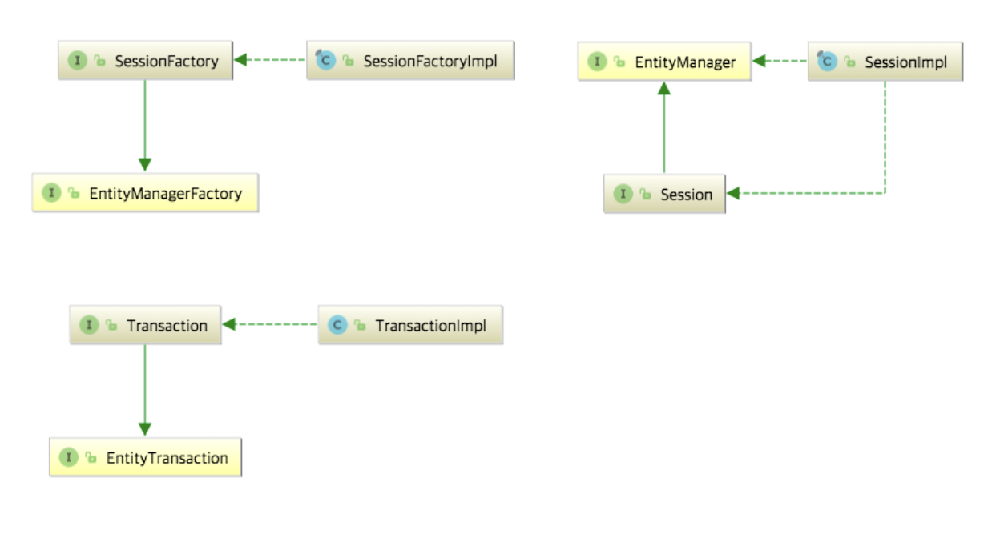
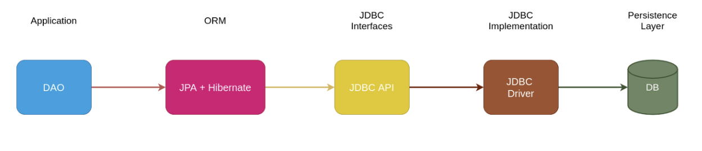

### MyBatis 란?

>마이바티스는 개발자가 지정한 SQL, 저장프로시저 그리고 몇가지 고급 매핑을 지원하는 퍼시스턴스 프레임워크이다. 마이바티스는 JDBC 로 처리하는 상당 부분의 코드와 파라미터 설정 및 결과 매핑을 대신해준다. 마이바티스는 데이터베이스 레코드에 원시타입과 Map 인터페이스 그리고 자바 POJO 를 설정해서 매핑하기 위해 XML 과 애노테이션을 사용할 수 있다.

<br>

`MyBatis 이전의 자바에서의 SQL`

자바에서는 기본적으로 자바 언어를 통해서 DB 를 사용하기 위한 `JDBC(Java Database Connectivity)` 라는 API 를 제공합니다. 

다음은 JDBC 를 이용하여 DB 를 제어하는 예시 코드이다.

```Java
import java.sql.Connection;
import java.sql.DriverManager;
import java.sql.ResultSet;
import java.sql.Statement;

public class JDBCTutorial {
    public static void main(String[] args) {
        // DB 에 접속하기 위한 정보 
        String jdbcURL = "jdbc:mysql://localhost:3306/mydatabase";
        String username = "username";
        String password = "password";

        try {
            // 데이터베이스 연결
            Connection connection = DriverManager.getConnection(jdbcURL, username, password);

            // SQL 쿼리 실행
            Statement statement = connection.createStatement();
            ResultSet resultSet = statement.executeQuery("SELECT * FROM mytable");

            // 결과 처리
            while (resultSet.next()) {
                // 데이터 읽기
                int id = resultSet.getInt("id");
                String name = resultSet.getString("name");

                // 결과 처리 로직 작성
                System.out.println("ID: " + id + ", Name: " + name);
            }

            // 리소스 정리
            resultSet.close();
            statement.close();
            connection.close();
        } catch (Exception e) {
            e.printStackTrace();
        }
    }
}

```

<br>

매우 간단한 select 쿼리 하나를 날리기 위해서 `connection` 을 열어서 쿼리를 실행하고 결과를 받아서 처리하고 리소스까지 정리를 해줘야하는 부수적인 작업이 많다. 또한, 자바 코드 사이에 쿼리문이 섞여있기 때문에 쿼리에 집중하기가 어렵다. 

이러한 복잡한 작업들을 간소화하고 쿼리 작성에 집중하고 싶다는 니즈에서 MyBatis 는 생겨났다. 

<br>

**MyBatis 의 주요 특징**

- `SQL 매핑(XML 기반)`: MyBatis 는 SQL 쿼리를 자바 코드가 아닌 별도의 XML 파일에 작성할 수 있게 해준다. 이를 통해 SQL 과 자바 객체 간의 매핑이 명시적으로 이루어지며, 유지보수가 쉬워진다.

- `객체-관계 매핑(ORM) 지원`: MyBatis 는 자바 객체와 데이터베이스 레코드 간의 매핑을 처리하는데, 이를 통해 객체지향적인 코드 작성이 가능하다. 데이터베이스 테이블과 자바 클래스 간의 관계를 선언하고, MyBatis 가 이를 처리해주는 방식으로 동작한다.

- `다양한 매개변수 전달 방식`: MyBatis 는 단일 값, 맵, 자바 빈 등 다양한 형태의 매개변수를 전달할 수 있도록 지원한다. 이는 SQL 쿼리의 유연성을 높여주며, 동적인 쿼리를 작성할 수 있게 해준다.

- `자동 생성된 키 지원`: MyBatis 는 자동으로 생성된 키(primary key)를 처리하는 기능을 제공한다. 이를 통해 데이터베이스에 레코드를 추가할 때 발생하는 자동 생성된 키를 쉽게 얻을 수 있다.

- `다양한 결과 매핑`: MyBatis 는 단일 값, 자바 빈, 맵 등 다양한 형태의 쿼리 결과를 처리할 수 있다. 이를 통해 쿼리 결과를 자바 객체로 매핑하거나 필요에 따라 다양한 형태로 처리할 수 있다.

<br>

MyBatis 를 활용하면 다음과 같은 방식으로 간단한 select 쿼리를 실행할 수 있다. 

```Java
//Mapper
Optional<Post> findById(Long id);

//xml
<select id="findById" resultType="Post">
    SELECT id, writer_id, title, content, create_date, modified_date, views
    FROM post
    where id = #{id}
</select>

//Repository
@Override
public Optional<Post> findById(Long id) {
    return postMapper.findById(id);
}
```

<br>

MyBatis 의 가장 큰 장점은 자바 코드와 쿼리가 완벽하게 분리된다는 점이다. 자바와 쿼리가 분리됨으로써 DB 쿼리에 좀 더 집중할 수 있다. 

반면, 단점은 쿼리를 실행할 때마다 `SqlSession` 을 열고 닫아줘야 한다는 점이다. 또한, xml 에 정의되어 있는 property 에 오타 같은 부분이 있어도 런타임에서야 에러를 낸다는 점이다. 이렇게 되면 변수에 대한 리팩토링을 진행할 때 변수를 잘못 바꾼 부분이 없는지 주의를 기울여야 한다. 

물론, IDE 의 플러그인 ( 예시 : [MyBatisX 플러그인](https://plugins.jetbrains.com/plugin/10119-mybatisx) ) 을 쓰면 IDE 에서 어느정도 검증할 수 있지만, 컴파일러에서 검증되지 않기 때문에 여전히 런타임에서야 오류를 확인할 수 있다. 

<br>

**SqlSession 은 무엇인가?**

MyBatis 에서 SQL 의 실행, 트랜잭션 관리, 객체를 관리하는 중요한 객체이다.

`SqlSession 을 통해 할 수 있는 것`

- **쿼리 캐싱**: `SqlSession` 을 사용하여 동일한 쿼리를 여러 번 실행해야 하는 경우, MyBatis 는 결과를 캐싱하여 성능을 향상시킬 수 있습니다. `SqlSession` 의 쿼리 캐싱 기능을 활용하여 반복적으로 실행되는 쿼리의 결과를 메모리에 저장하여 불필요한 데이터베이스 호출을 줄일 수 있습니다.

- **일괄 처리 (Batch Processing)**: MyBatis 의 `SqlSession` 을 사용하여 일괄 처리 기능을 활용할 수 있습니다. 일괄 처리를 사용하면 여러 개의 쿼리를 한 번에 실행하여 데이터베이스와의 통신 횟수를 줄일 수 있으므로 성능을 향상시킬 수 있습니다. 특히 대량의 데이터를 삽입, 업데이트 또는 삭제해야 할 때 유용합니다.

- **세션 유지 및 풀링**: `SqlSession` 의 유지와 풀링을 통해 성능을 향상시킬 수 있습니다. 세션을 재사용하고 풀링하여 데이터베이스 연결의 오버헤드를 줄일 수 있으며, 더 효율적으로 리소스를 관리할 수 있습니다.

- **동적 SQL 최적화**: MyBatis 는 동적 SQL 을 작성할 때 유연한 방식을 제공합니다. `SqlSession` 을 사용하여 동적 SQL 을 구성하고 실행할 때 최적화된 쿼리를 생성할 수 있으며, 이를 통해 데이터베이스와의 효율적인 상호작용을 달성할 수 있습니다.


`SqlSession 을 사용할 때 주의해야할 점`

- **자원 해제**: `SqlSession` 은 데이터베이스와의 연결을 나타내는 중요한 자원이므로 사용이 끝나면 반드시 자원을 해제해야 한다. 이는 `close()` 메서드를 호출하여 수행된다. 보통은 `try-with-resources` 블록이나 `finally` 블록 안에서 `SqlSession` 을 사용하여 자원을 해제한다.

- **스레드 안전성**: `SqlSession` 은 스레드 간에 공유되지 않아야 한다. 즉, 각각의 스레드에서 독립적인 `SqlSession` 인스턴스를 사용해야 한다. 보통은 각 요청에 대해 새로운 `SqlSession` 을 생성하여 사용하고, 사용이 끝나면 적절히 자원을 해제한다.

- **캐싱 관리**: MyBatis 는 캐싱을 통해 성능을 향상시키는데, `SqlSession` 을 통해 실행된 쿼리 결과는 기본적으로 캐싱될 수 있다. 이는 개발자가 적절한 방식으로 캐싱을 관리하고 이를 고려하여 `SqlSession` 을 사용해야 함을 의미한다.

<br>

### Spring JDBC 란?

Spring JDBC는 스프링 프레임워크에서 제공하는 `JDBC(Java Database Connectivity)` 기반의 데이터 액세스 기술이다. JDBC는 자바 언어를 사용하여 관계형 데이터베이스에 접근하고 조작하기 위한 표준 API이다.

JDBC 는 `connection, preparedStatement, resultSet` 등을 열고 닫고 자원을 관리해야하는 번거로움이 있다면 Spring JDBC 는 `JDBCTemplate` 을 통해 이러한 번거로운 과정을 자동으로 처리해준다.

<br>

`MyBatis 대비 Spring JDBC 의 강점`

- **간단한 사용법**: Spring JDBC 는 직접적이고 간단한 JDBC 접근 방식을 제공합니다. MyBatis 와는 달리 SQL 쿼리와의 매핑이나 설정 파일이 필요하지 않습니다. 따라서 간단한 데이터 액세스 작업을 빠르게 구현할 수 있습니다.

- **Spring 프레임워크와의 통합**: Spring JDBC 는 Spring 프레임워크와 높은 수준의 통합을 제공합니다. 이는 Spring 의 다양한 기능과 라이프사이클 관리, 트랜잭션 관리 등과의 원활한 통합을 의미합니다.

- **트랜잭션 관리**: Spring JDBC 는 Spring 의 트랜잭션 관리 기능을 활용하여 트랜잭션을 쉽게 관리할 수 있습니다. 선언적 트랜잭션 관리, 프로그래밍 방식의 트랜잭션 관리 등 다양한 방식을 지원하여 개발자가 트랜잭션을 쉽게 구현하고 관리할 수 있습니다.

- **ORM 기능의 불필요**: Spring JDBC 는 객체-관계 매핑(ORM) 기능을 제공하지 않으므로 복잡한 매핑 작업을 필요로 하지 않습니다. 따라서 간단한 데이터 액세스 작업에는 MyBatis 보다 더 적합할 수 있습니다.

- **커스터마이징 가능**: Spring JDBC 는 각종 확장 포인트를 제공하여 개발자가 데이터 액세스 작업을 커스터마이징할 수 있습니다. 필요에 따라 JDBC Template 을 확장하여 추가 기능을 구현할 수 있습니다.

- **성능**: Spring JDBC 는 간단하고 직접적인 접근 방식을 채택하여 오버헤드가 적습니다. 따라서 단순한 데이터 액세스 작업의 경우에는 MyBatis 보다 더 빠른 성능을 보일 수 있습니다.

<br>

**Groovy 를 통한 SQL 선언**

```Groovy
// 기본 쿼리 
class GroovySQL {
    public static final String SELECT = 
    """
        SELECT *
        FROM EMP
    """;
}

// Spring JDBC 에서의 쿼리 사용
public Emp selectEmp() {
    return NamedParameterJdbcTemplate.query(GroovySQL.SELECT, resultSetExtractor);
}

// MyBatis 에서의 활용 방안
@Select(GroobySQL.SELECT)
public Emp selectEmp() {

}

// 자주 사용되는 공통 기능을 Utils 로 만들어 활용 가능
class SQLUtils {
    private static String notEmpty(String param, String condition) {
        return StringUtils.isEmpty(param)? null: condition;
    }

    private static String whereAnd(String ... conditions) {
        List<String> finalCond = conditions.findAll({it != null});
        Assert.notEmpty(finalCond);
        return "WHERE " + finalCond.join("\nAND ");
    }
}
```

<br>

`XML 보다 Groovy 로 SQL 을 작성하면 좋은 점은 무엇일까?` 
- Groovy 의 문법 체계는 자바의 것을 계승했기 때문에 XML 보다 쉽게 배워 사용할 수 있다.
- XML 을 통한 맵핑은 오타나 실수로 인한 부분을 런타임에서야 발견할 수 있는데 Groovy 는 상수 값을 참조하는 형태로 이뤄지기 때문에 컴파일 타임에서 오류를 찾을 수 있다. 쿼리에 대한 문법 오류는 XML 이나 multiLine String 에서도 런타임에서나 에러를 낸다는 한계점이 있다.
- 변수명을 한 번에 바꾼다던지 편리한 IDE 의 기능을 쉽게 사용할 수 있다. 

<br>

### JPA 란?

JPA (Java Persistence API) 는 자바 애플리케이션에서 관계형 데이터베이스를 쉽게 사용할 수 있도록 도와주는 표준 API 입니다. JPA 는 ORM(Object-Relational Mapping) 기술을 사용하여 자바 객체와 관계형 데이터베이스 테이블 간의 매핑을 자동화합니다.

<br>

>**영속성 (Persistence) 란?**
> 
> 한 객체가 자신을 생성한 작업이 종료되었음에도 불구하고 지속적으로 존재하는 상태를 말한다.

<br>

JPA 는 인터페이스이기 때문에 어떤 구체적인 코드가 구현되어 있지 않습니다. 관계형 데이터베이스를 자바라는 객체지향 프로그래밍 언어에서 객체지향적인 관점으로 설계하기 위한 가장 좋은 방법을 JPA 라고 부르는 것입니다.


`JPA 가 단순히 인터페이스라면 어떤 구체적인 코드로 ORM 을 구현하는 것인가`

가장 대표적인 JPA 의 구현체는 `Hibernate` 입니다. 

<br>



<br>

위의 그림을 보면 JPA 의 가장 핵심적인 `EntityManagerFactory`, `EntityManager`, `EntityTransaction` 을 `Hibernate` 에서 `SessionFactory`, `Session`, `Transaction` 으로 상속받고 구현하고 있음을 알 수 있다.

<br>



<br>

`JPA 를 사용하면 어떤 점이 좋을까?`
- Connection, ResultSet, Session 등 반복적으로 수행해야 하는 코드를 줄일 수 있다.
- 관계형 데이터베이스를 매핑하는 작업을 대신해준다.
- 기본적인 CRUD 쿼리를 자동으로 구현해준다.
- 객체 수정에 따른 SQL 코드 수정 작업이 필요없다.
- 캐싱을 지원하여 수행한 결과를 빠르게 가져올 수 있다.

<br>

`JPA 가 무조건적으로 좋은 기술인가?`
- 실제 쿼리만큼 성능이 뛰어나지 않다.
- 데이터베이스가 복잡해지고 데이터가 늘어나면 한계가 보인다.
- 활용 방안에 따라 성능 차이가 나고 오류에 대한 처리가 쉬울 수도 어려울 수도 있다.
- SQL 을 쓰는 것 만큼이나 Entity 의 생명주기, 캐시, 지연 로딩, 컬렉션 매퍼 등 다양한 옵션을 고려해야 한다는 점에서 결코 러닝 커브가 적지 않다.

### 어떤 기술을 선택해야할까?


### 참고자료 
> [MyBatis 공식문서](https://mybatis.org/mybatis-3/ko/index.html)
> 
> [JDBC vs MyBatis vs JPA 도입 고민 관련](https://velog.io/@gale4739/DB%EC%99%80%EB%8A%94-%EC%96%B4%EB%96%A4-%EA%B1%B8%EB%A1%9C-%EC%97%B0%EA%B2%B0%ED%95%A0%EA%B9%8C-JDBC-vs-JPA-vs-MyBatis)
> 
> [MyBatis 와 JPA 비교 - 이랜서](https://www.elancer.co.kr/blog/view?seq=231)
> 
> [MyBatis - SqlSession 관련 정리글](https://gdngy.tistory.com/160)
> 
> [MyBatis 와 Spring JDBC 비교글](https://hello-bryan.tistory.com/335)
> 
> [JDBC, Spring Data JDBC, MyBatis 비교](https://blog.neonkid.xyz/223)
> 
> [Hibernate, JPA, Spring Data JPA 비교](https://blog.neonkid.xyz/224)