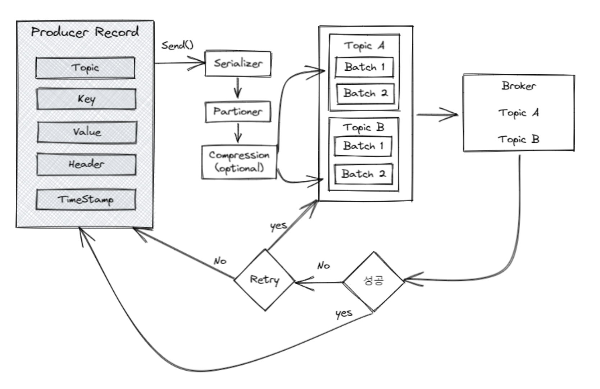
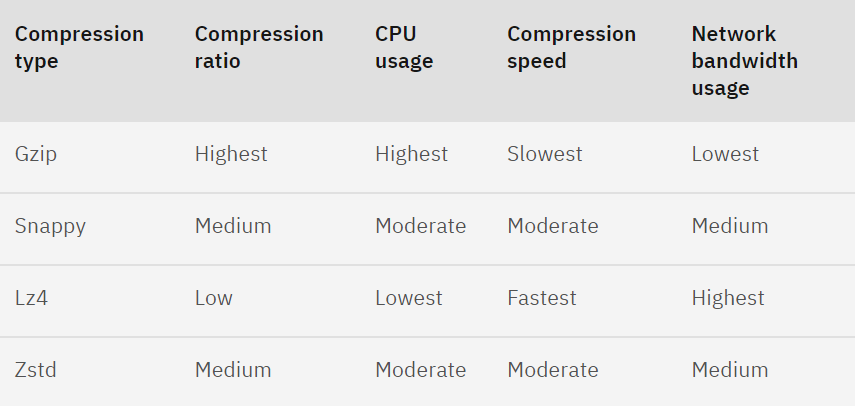
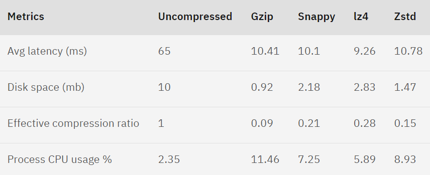
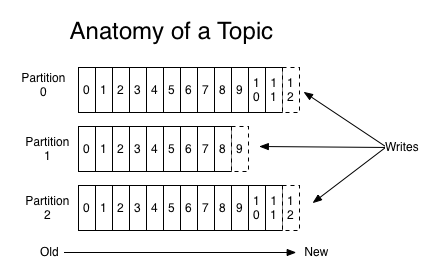

# Apache Kafka 

## 카프카에서 사용되는 개념

> **Producer**
>
> Kafka 에 데이터를 토픽에 발행하는 주체
> 

> **Consumer**
> 
> Kafka 에서 저장된 데이터를 읽어오고 처리하는 프로그램 또는 애플리케이션입니다.

> **Broker**
> 
> 하나의 카프카 서버를 브로커라고 한다. Kafka 의 핵심 구성 요소로, 데이터를 저장하고 관리하는 역할을 합니다.

> **Cluseter**
> 
> 여러 개로 분산되어 있는 서비스들을 하나의 서비스처럼 동작하도록 관리하는 것을 클러스터링이라고 한다. 
> 
> 카프카는 대용량의 데이터를 처리하기 위해 클러스터링이 용이하도록 설계되어 있다. 

<br>


<br>

> **Topic**
> 
> Kafka 에서 데이터를 분류하고 관리하는 주제 또는 카테고리입니다.

> **Partition**
> 
> 토픽을 여러 개의 파티션으로 분할하는 개념입니다. 각 파티션은 독립적인 데이터 스트림을 유지합니다.

<br>


<br>

> **Consumer Group**
> 
> 여러 Consumer 를 하나의 그룹으로 구성하여 토픽의 모든 메시지를 읽을 수 있도록 합니다. 
> 각 Consumer 는 파티션을 할당받아 데이터를 처리합니다.

> **Offset**
> 
> Kafka 에서 각 메시지를 식별하는 값입니다. Consumer 는 Offset 을 기반으로 어떤 메시지를 이미 처리했는지 추적합니다.

> **Zookeeper**
> 
> Kafka 클러스터의 구성을 관리하고, Broker 간의 통신을 위한 서비스입니다. Kafka 애플리케이션의 안정성을 유지하는 데 중요한 역할을 합니다.

## 카프카의 특징


- 실시간 데이터 처리
  - Kafka 는 높은 처리 속도와 처리량을 지원하여 실시간 데이터 처리에 적합합니다. 
  - 데이터를 순차적으로 처리하고, 데이터 흐름을 유지하여 실시간 분석이나 응답이 필요한 애플리케이션에 적합합니다.


- 스케일링
  - Kafka 는 여러 Broker 를 사용하여 데이터를 분산 저장하고 처리합니다 
  - 이는 데이터 규모가 커지더라도 처리량을 유지할 수 있도록 스케일링 가능합니다. 

  
- 데이터 유형 다양성
  - Kafka 는 JSON, Avro, Protobuf 등 다양한 데이터 형식을 지원합니다. 
  - 이는 다양한 애플리케이션에서 사용할 수 있는 유연성을 제공합니다.


- 낮은 지연 시간
  - Kafka 는 메시지를 빠르게 전송하고 처리하여 낮은 지연 시간을 제공합니다.
  - 실시간 데이터 처리 요구 사항을 충족하는 데 유리합니다.
  - 기본적으로 배치 기능을 제공합니다.


- 안정성
  - Kafka 는 복잡한 시스템이지만, 데이터 유지보증 및 안정성을 위한 여러 기능을 제공합니다.
  - 암호화, 토픽 및 파티션 분산, 복구 기능 등을 통해 데이터 손실을 최소화합니다.


- 안전성
  - Kafka 는 TLS/SSL 암호화를 통해 데이터 보안을 제공합니다.
  - 이는 데이터 유출을 방지하고, 민감한 정보를 보호하는 데 중요합니다.


- 확장성
  - Kafka 는 새로운 기능을 추가하거나 확장하기 쉬운 아키텍처를 가지고 있습니다.
  - 업그레이드 및 유지보수가 용이합니다.

## 통신 프로토콜

TCP-based 의 프로토콜을 사용

## 메시지를 저장하는 방식

디스크에 로그 형태로 메시지를 저장한다.

각 메시지는 `offset` 이라는 인덱스 값을 가지는데 해당 값을 통해서 특정 메시지들을 가져와 사용할 수 있다.

메시지를 디스크에 저장하기 때문에 유실로부터 안전하지만 메모리에 비해 성능은 약간 떨어진다.

하지만 카프카는 디스크에 메시지를 순차적으로 저장하여 

`RabbitMQ` 로 대표되는 메시지 큐의 경우 메모리에 큐 형태로 메시지를 저장한다.

## Producer 



- ProducerRecord<K, V> : Producer 가 메시지 큐로 보내는 데이터의 형태
  - Topic (필수)
  - partitions
  - Key
  - Value (필수)
  - Header 
  - Timestamp

<br>

이렇게 보내진 메시지는 제일 먼저 Serializer 에 의해서 `직렬화` 되는 과정을 거친다. 

> **직렬화와 역직렬화**
>
> 직렬화(serialize)란 자바 언어에서 사용되는 Object 또는 Data를 다른 컴퓨터의 자바 시스템에서도 사용 할수 있도록 바이트 스트림(stream of bytes) 형태로 연속전인(serial) 데이터로 변환하는 포맷 변환 기술을 일컫는다. 그 반대 개념인 역직렬화는(Deserialize)는 바이트로 변환된 데이터를 원래대로 자바 시스템의 Object 또는 Data로 변환하는 기술이다.


가장 일반적으로는 Json 형식으로 데이터를 주고 받는다. 

아래와 같은 방식으로 어떤 클래스로 직렬화/역직렬화를 할 것인지 지정할 수 있다. 

```yaml
# application.yaml 
spring:
  kafka:
    producer:
      value-serializer: org.springframework.kafka.support.serializer.JsonSerializer
    consumer:
      value-deserializer: org.springframework.kafka.support.serializer.JsonDeserializer
```

<br>

직렬화가 끝난 데이터들은 partitioner 에 의해서 특정 토픽 내의 파티션으로 데이터들을 분배한다.

이 때, 파티션을 지정하지 않았다면 키의 해쉬값을 이용하여 적절한 파티션으로 보내진다.

만약 파티션과 키를 모두 지정하지 않았다면 라운드-로빈 방식에 의해서 적절한 파티션으로 메시지가 보내진다.

> **라운드-로빈 방식**
>
> 라운드 로빈 스케줄링(Round Robin Scheduling, RR)은 시분할 시스템을 위해 설계된 선점형 스케줄링의 하나로서, 프로세스들 사이에 우선순위를 두지 않고, 순서대로 시간단위(Time Quantum/Slice)로 CPU를 할당하는 방식의 CPU 스케줄링 알고리즘입니다.

<br>

파티셔닝까지 마무리되면 선택적으로 압축을 진행할 수 있다.

앞서 살펴봤듯이 카프카는 메시지를 디스크에 저장하기 때문에 메시지 크기가 크면 클 수록 데이터 저장에 대한 부담이 증가한다.

카프카에서 제공하는 압축의 형식은 다음과 같다.



또한 카프카에서는 각 압축 형식별로 성능 지표들을 공개하고 있다.



JSON 메시지를 이용하고 있다면, Snappy와 Lz4 와 같은 entropy-less 엔코더를 사용하길 권장하고 있습니다.

메시지의 형태에 따라서 적절한 형식의 압축 방법을 채택해야 합니다. 또한 선택적으로 제공되는 옵션인 만큼 압축이 필요한지 고려하여 사용해야 합니다.

<br>

## Message Broker

메시지 브로커는 Producer 에서 발행한 메시지를 보관해주는 우편함이라고 생각하면 이해하기 쉽다. 

카프카는 Broker 서버 한 대라고 생각하면 된다. 카프카는 cluster 라는 이름으로 Broker 서버 여러 개를 묶어서 관리하기 편하도록 되어있다.

앞서 서술한 바와 같이 카프카는 디스크에 메시지를 저장하기 때문에 유실로부터 안전하다. 

또 메시지를 여러 브로커에 분산하여 저장함으로써 더욱 유실의 가능성을 낮춘다.

또 다른 장점으로는 여러 브로커, 하나의 토픽에서 여러 파티션으로 분산하여 데이터를 저장하고 이를 병렬적으로 처리할 수 있도록 되어있기 때문에 성능 또한 뛰어나다.

### kafka partition



카프카에서 메시지를 파티션에 담는 방식은 위 그림과 같다.

파티션 내에는 `offset` 이라는 인덱스 값이 존재해서 `offset` 이라는 값만 알고 있으면 한 번 소비한 메시지도 다시 가져올 수 있다.

또한, 파티션과 `offset` 값을 이용해서 특정 메시지들을 원하는 방식으로 소비해서 처리하기 편하다.

`카프카에서 파티셔닝이 왜 중요할까?`

만약에 100개의 서비스에서 하나의 토픽으로 메시지를 발행하고 파티션은 하나만 존재한다고 가정해보자.

카프카는 디스크에 메시지를 보관하고 순서를 보장해야 한다. 때문에 100개를 한 번에 처리할 수 없고 병목현상이 발생하게 된다.

하지만 파티션을 나눠서 데이터를 입력한다면 파티션이 나뉜만큼 시간이 1/n 만큼 줄어들 것이다.

`그렇다면 파티션을 무조건 늘리는 것이 좋을 방법일까?`

파티션을 늘리게 되면 다음과 같은 단점들이 발생한다.

- **브로커 파일 시스템 리소스 사용량 증가**

Kafka 브로커는 파티션별로 데이터를 저장하는데 이때 단순 데이터 정보(.log 파일)뿐만 아니라 메타 정보(.index, .timeindex, .snapshot 파일)도 함께 저장한다. 따라서 파티션이 많아질수록 많아지는 파일에 대한 파일 오픈 비용, 디스크 사용량 비용 등이 추가로 필요해진다.

- **장애에 더 취약한 구조**
- **복제 비용 증가**

파티션 단위로 설정된 replicas 수만큼 복제가 이루어지기 때문에 복제로 인한 디스크 사용량, latency가 증가한다.
파티션 수가 적은 환경에서는 어쩌면 큰 문제가 아닐 수 있지만, 과도하게 늘어나 있는 환경에서는 문제가 될 수 있다.

<br>

## Consumer

컨슈머는 발행되는 메시지를 소비하는 주체다.

`Consumer 를 구성할 때 필수적인 값`
- bootstrap.servers
- group.id
- key.deserializer
- value.deserializer

컨슈머는 메시지를 읽고 어디까지 읽었는지 책갈피를 기억한다. 이 때 어디까지(offset) 읽었는지는 컨슈머에서 보관하는 것이 아닌 브로커에서 보관하여 유실을 방지한다.

Consumer 는 반드시 컨슈머 그룹에 포함되어 있어야 한다.

카프카는 메시지를 저장하기 위한 것이 아니고 연결하기 위한 도구이기 때문에 발행된 메시지는 반드시 소비되어야 한다.

때문에 컨슈머 그룹이 있어 하나의 컨슈머가 장애가 생기더라도 다른 컨슈머에서 메시지에 대해서 처리를 할 수 있도록 하는 것이다.

하나의 컨슈머에서 장애가 발생하여 다른 컨슈머에게 메시지의 처리를 맡기는 과정을 리밸런싱 과정을 거친다고 한다.

`Consumer 는 어떻게 메시지를 소비할까?`

카프카는 디스크에 메시지를 저장하기 때문에 값을 읽을 때마다 CPU 성능에 영향을 미친다.

만약 적은 데이터를 읽는 과정이 빈번하게 일어난다면 성능이 떨어지게 될 것이다.

때문에 kafka 는 아래와 같은 옵션들을 제공하고 있다.

| 옵션                          | 설명                                     |
|-----------------------------|----------------------------------------|
| `fetch.max.bytes`           | 한번에 가져 올 수 있는 최소 크기, 다 채워지지 않는다면 기다린다. |
| `max.partition.fetch.bytes` | 파티션당 가져올 수 있는 최대 크기                    |
| `max.poll.records`          | `poll`로 가져오는 최대 레코드 수                  |
| `fetch.max.wait.ms`         | 이 설정 값보다 적은 경우 요청에 대한 응답을 기다리는 최대 시간   |


`Consumer 주요 옵션`

| 옵션                              | 설명                                                                                                |
|---------------------------------|---------------------------------------------------------------------------------------------------|
| `fetch.max.bytes`               | 한번에 가져 올 수 있는 최소 크기, 다 채워지지 않는다면 기다린다.                                                            |
| `group.id`                      | 컨슈머가 속한 컨슈머 그룹을 식별하는 식별자                                                                          |
| `heartbeat.interval.ms`         | 컨슈머 그룹이 active 상태임을 나타냄. `session.timeout.ms`보다 낮은 값을 설정해야 함, 일반적으로 `session.timeout.ms`의 1/3로 설정 |
| `max.partition.fetch.bytes`     | 파티션당 가져올 수 있는 최대 크기                                                                               |
| `session.timeout.ms`            | 컨슈머가 종료된 것인지 파악하는 시간. 이 시간까지 하트비트를 보내지 않으면 컨슈머가 종료된 것으로 판단하고 리밸런싱 함.                              |
| `enable.auto.commit`            | 백그라운드로 주기적으로 오프셋을 커밋                                                                              |
| `auto.offset.reset`             | `earliest`: 가장 초기의 오프셋 값으로 설정, `latest`: 가장 마지막의 오프셋 값으로 설정, `none`: 이전 오프셋 값을 찾지 못하면 에러          |
| `group.instance.id`             | 컨슈머의 고유 식별자. static 멤버로 등록되어 불필요한 리밸런싱을 하지 않음                                                     |
| `isolation.level`               | 트랜잭션 컨슈머에서 사용되는 옵션                                                                                |
| `max.poll.records`              | `poll`로 가져오는 최대 레코드 수                                                                             |
| `partition.assignment.strategy` | 파티션 할당 전략. 기본값은 `range`                                                                           |
| `fetch.max.wait.ms`             | 이 설정 값보다 적은 경우 요청에 대한 응답을 기다리는 최대 시간                                                              |


> ## 참고
> 
> [아파치 카프카란 무엇일까?](https://ssdragon.tistory.com/117)
> 
> [라인에서 카프카를 사용하는 방법](https://engineering.linecorp.com/ko/blog/how-to-use-kafka-in-line-1)
> 
> [카프카 Producer 원리 관련 글](https://magpienote.tistory.com/251)
> 
> [카프카 Producer 압축 관련](https://velog.io/@wwlee94/Kafka-%EB%A9%94%EC%8B%9C%EC%A7%80-%EC%95%95%EC%B6%95%EC%97%90-%EB%8C%80%ED%95%98%EC%97%AC)
> 
> [카프카 Broker 원리](https://magpienote.tistory.com/252)
> 
> [카프카 파티션 관련](https://curiousjinan.tistory.com/entry/understand-kafka-partitions)
> 
> [Kafka에서 파티션 증가 없이 동시 처리량을 늘리는 방법 - Parallel Consumer ( Naver D2 )](https://d2.naver.com/helloworld/7181840)
> 
> [카프카 Consumer 원리](https://magpienote.tistory.com/254)
> 
> [카프카 공식 문서 - 설정](https://kafka.apache.org/documentation/#configuration)
> 
> [카프카 적용 정리한 github repo](https://github.com/Youngerjesus/spring-boot-kafka-guide)