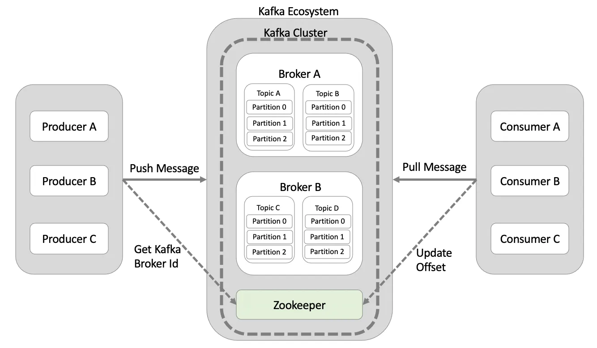

# Apache Kafka 

## 카프카에서 사용되는 개념

> **Producer**
>
> Kafka 에 데이터를 토픽에 발행하는 주체
> 

> **Consumer**
> 
> Kafka 에서 저장된 데이터를 읽어오고 처리하는 프로그램 또는 애플리케이션입니다.

> **Broker**
> 
> 하나의 카프카 서버를 브로커라고 한다. Kafka 의 핵심 구성 요소로, 데이터를 저장하고 관리하는 역할을 합니다.

> **Cluseter**
> 
> 여러 개로 분산되어 있는 서비스들을 하나의 서비스처럼 동작하도록 관리하는 것을 클러스터링이라고 한다. 
> 
> 카프카는 대용량의 데이터를 처리하기 위해 클러스터링이 용이하도록 설계되어 있다. 

<br>



<br>

> **Topic**
> 
> Kafka 에서 데이터를 분류하고 관리하는 주제 또는 카테고리입니다.

> **Partition**
> 
> 토픽을 여러 개의 파티션으로 분할하는 개념입니다. 각 파티션은 독립적인 데이터 스트림을 유지합니다.

<br>


<br>

> **Consumer Group**
> 
> 여러 Consumer 를 하나의 그룹으로 구성하여 토픽의 모든 메시지를 읽을 수 있도록 합니다. 
> 각 Consumer 는 파티션을 할당받아 데이터를 처리합니다.

> **Offset**
> 
> Kafka 에서 각 메시지를 식별하는 값입니다. Consumer 는 Offset 을 기반으로 어떤 메시지를 이미 처리했는지 추적합니다.

> **Zookeeper**
> 
> Kafka 클러스터의 구성을 관리하고, Broker 간의 통신을 위한 서비스입니다. Kafka 애플리케이션의 안정성을 유지하는 데 중요한 역할을 합니다.

## 카프카의 특징


- 실시간 데이터 처리
  - Kafka 는 높은 처리 속도와 처리량을 지원하여 실시간 데이터 처리에 적합합니다. 
  - 데이터를 순차적으로 처리하고, 데이터 흐름을 유지하여 실시간 분석이나 응답이 필요한 애플리케이션에 적합합니다.


- 스케일링
  - Kafka 는 여러 Broker 를 사용하여 데이터를 분산 저장하고 처리합니다 
  - 이는 데이터 규모가 커지더라도 처리량을 유지할 수 있도록 스케일링 가능합니다. 

  
- 데이터 유형 다양성
  - Kafka 는 JSON, Avro, Protobuf 등 다양한 데이터 형식을 지원합니다. 
  - 이는 다양한 애플리케이션에서 사용할 수 있는 유연성을 제공합니다.


- 낮은 지연 시간
  - Kafka 는 메시지를 빠르게 전송하고 처리하여 낮은 지연 시간을 제공합니다.
  - 실시간 데이터 처리 요구 사항을 충족하는 데 유리합니다.
  - 기본적으로 배치 기능을 제공합니다.


- 안정성
  - Kafka 는 복잡한 시스템이지만, 데이터 유지보증 및 안정성을 위한 여러 기능을 제공합니다.
  - 암호화, 토픽 및 파티션 분산, 복구 기능 등을 통해 데이터 손실을 최소화합니다.


- 안전성
  - Kafka 는 TLS/SSL 암호화를 통해 데이터 보안을 제공합니다.
  - 이는 데이터 유출을 방지하고, 민감한 정보를 보호하는 데 중요합니다.


- 확장성
  - Kafka 는 새로운 기능을 추가하거나 확장하기 쉬운 아키텍처를 가지고 있습니다.
  - 업그레이드 및 유지보수가 용이합니다.

## 통신 프로토콜

TCP-based 의 프로토콜을 사용

## 메시지를 저장하는 방식

디스크에 로그 형태로 메시지를 저장한다.

각 메시지는 `offset` 이라는 인덱스 값을 가지는데 해당 값을 통해서 특정 메시지들을 가져와 사용할 수 있다.

메시지를 디스크에 저장하기 때문에 유실로부터 안전하지만 메모리에 비해 성능은 약간 떨어진다.

하지만 카프카는 디스크에 메시지를 순차적으로 저장하여 

`RabbitMQ` 로 대표되는 메시지 큐의 경우 메모리에 큐 형태로 메시지를 저장한다.

## Producer 


- ProducerRecord<K, V> : Producer 가 메시지 큐로 보내는 데이터의 형태
  - Topic (필수)
  - partitions
  - Key
  - Value (필수)
  - Header 
  - Timestamp

<br>

이렇게 보내진 메시지는 제일 먼저 Serializer 에 의해서 `직렬화` 되는 과정을 거친다. 

> **직렬화와 역직렬화**
>
> 직렬화(serialize)란 자바 언어에서 사용되는 Object 또는 Data를 다른 컴퓨터의 자바 시스템에서도 사용 할수 있도록 바이트 스트림(stream of bytes) 형태로 연속전인(serial) 데이터로 변환하는 포맷 변환 기술을 일컫는다. 그 반대 개념인 역직렬화는(Deserialize)는 바이트로 변환된 데이터를 원래대로 자바 시스템의 Object 또는 Data로 변환하는 기술이다.


가장 일반적으로는 Json 형식으로 데이터를 주고 받는다. 

아래와 같은 방식으로 어떤 클래스로 직렬화/역직렬화를 할 것인지 지정할 수 있다. 

```yaml
# application.yaml 
spring:
  kafka:
    producer:
      value-serializer: org.springframework.kafka.support.serializer.JsonSerializer
    consumer:
      value-deserializer: org.springframework.kafka.support.serializer.JsonDeserializer
```

<br>

직렬화가 끝난 데이터들은 partitioner 에 의해서 특정 토픽 내의 파티션으로 데이터들을 분배한다.

이 때, 파티션을 지정하지 않았다면 키의 해쉬값을 이용하여 적절한 파티션으로 보내진다.

만약 파티션과 키를 모두 지정하지 않았다면 라운드-로빈 방식에 의해서 적절한 파티션으로 메시지가 보내진다.

> **라운드-로빈 방식**
>
> 라운드 로빈 스케줄링(Round Robin Scheduling, RR)은 시분할 시스템을 위해 설계된 선점형 스케줄링의 하나로서, 프로세스들 사이에 우선순위를 두지 않고, 순서대로 시간단위(Time Quantum/Slice)로 CPU를 할당하는 방식의 CPU 스케줄링 알고리즘입니다.

<br>

파티셔닝까지 마무리되면 선택적으로 압축을 진행할 수 있다.

앞서 살펴봤듯이 카프카는 메시지를 디스크에 저장하기 때문에 메시지 크기가 크면 클 수록 데이터 저장에 대한 부담이 증가한다.

카프카에서 제공하는 압축의 형식은 다음과 같다.


또한 카프카에서는 각 압축 형식별로 성능 지표들을 공개하고 있다.


JSON 메시지를 이용하고 있다면, Snappy와 Lz4 와 같은 entropy-less 엔코더를 사용하길 권장하고 있습니다.

메시지의 형태에 따라서 적절한 형식의 압축 방법을 채택해야 합니다. 또한 선택적으로 제공되는 옵션인 만큼 압축이 필요한지 고려하여 사용해야 합니다.


> ## 참고
> 
> [아파치 카프카란 무엇일까?](https://ssdragon.tistory.com/117)
> 
> [라인에서 카프카를 사용하는 방법](https://engineering.linecorp.com/ko/blog/how-to-use-kafka-in-line-1)
> 
> [카프카 Producer 원리 관련 글](https://magpienote.tistory.com/251)
> 
> [카프카 Producer 압축 관련](https://velog.io/@wwlee94/Kafka-%EB%A9%94%EC%8B%9C%EC%A7%80-%EC%95%95%EC%B6%95%EC%97%90-%EB%8C%80%ED%95%98%EC%97%AC)
> 
> [카프카 Broker 원리](https://magpienote.tistory.com/252)
> 
> [카프카 Consumer 원리](https://magpienote.tistory.com/254)
> 
> [카프카 공식 문서 - 설정](https://kafka.apache.org/documentation/#configuration)
> 
> [카프카 적용 정리한 github repo](https://github.com/Youngerjesus/spring-boot-kafka-guide)