# rabbitmq

### 목차

1. amqp 프로토콜과 rabbitmq
2. 왜 사용하는가?
3. 설치 및 구동
4. 다른 메시지 큐 시스템 : 아파치 카프카, activemq 무엇이 다른가?


<br><br><br>
### 1. amqp 프로토콜과 rabbitmq

RabitMq 는 amqp프로토콜로 구현한 오픈소스 메시지 브로커로, 메시지를 많은 사용자에게 전달하거나, <br>
요청에 대한 처리 시간이 길때, 해당 요청을 다른 api 에게 위임하고 빠른 응답을 할 때 많이 사용한다.

​
### amqp 란?
<br>
advanced message queue protocol 의 줄임말로 메시지 지향 미들웨어를 위한 개방형 표준 응용 계층 프로토콜이다. publisher가 발행한 메시지는 message broker 를 통해 consumer 에게로 전송된다.<br> message broker 는 publisher 에게서 받은 메시지를 exchange 를 통해 어디로 전송할 지 결정하고 queue 에 적재한 메시지를 consumer 로 전송한다.<br> 

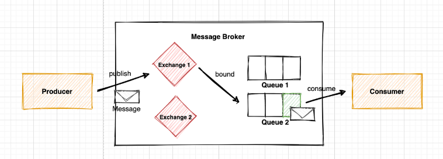<br><br>
`producing : 메시지를 보내는 시스템`<br>
`queue : rabbitmq의 우편함. 메시지 버퍼이다. 메시지가 rabbitmq와 application 에서 전송될때 queue 안에서만 저장될 수 있다.`<br>
`comsuming : 메시지를 받는 시스템`<br>
`Exchange : Publisher(Producer)로부터 수신한 메시지를 큐에 분배하는 라우터의 역할`<br>
`Binding : exchange 에게 메시지를 라우팅 할 규칙을 지정하는 행위`<br>

​

### Exchange 의 네가지 타입<br>
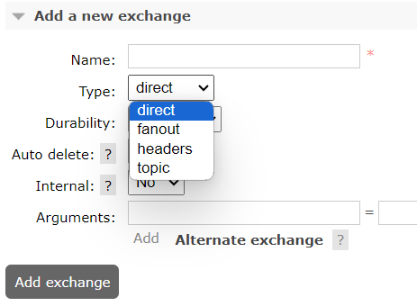<br><br>
1) Direct<br>
: 라우팅 키가 정확히 일치하는 queue 에 메시지 전송<br>
2) Topic<br>
: 라우팅 키 패턴이 일치하는 queue 에 메시지 전송<br>
3) Headers<br>
: key - value 로 이뤄진 header 값을 기준으로 일치하는 queue 에 메시지 전송<br>
4) Fanout<br>
: 해당 exchange 에 등록된 모든 queue 에 메시지 전송<br>
<br><br><br>
### 2. 왜 사용하는가?

​

rabbitmq 는 서비스간 연결 분리가 필요할 경우 용이하게 사용된다(Decoupling). <br>예를 들어, 푸시 알람과 이메일, 두가지 방식으로 사용자에게 알람을 보내야 할 경우 각각의 서비스를 담당하는 Queue 에 메시지를 publishing 한다.<br> 메시지 브로커를 사용할 경우 전체 서비스의 간섭 없이 알람 서비스 유지가 가능하다.<br>
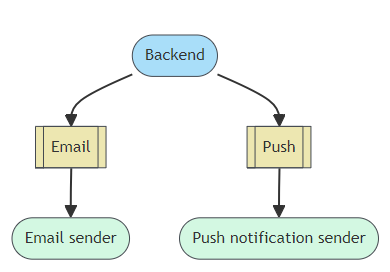<br>
<br><br><br>
### 3.설치 및 구동 

​
### 설치
공식문서의 설치 방법을 따른다.<br>

https://www.rabbitmq.com/docs/download<br>

윈도우의 경우 chocolatey 를 이용해 설치하는게 신상에 이롭다(...) rabbitmq 구동에 필요한 Erlang 버전과 호환이 잘 맞아야 하기 때문이다.<br><br>
```js

## 1. chocolatey 설치
   chocolatey 란? 윈도우에서 사용할 수 있는 커맨드 라인 패키지 매니저
## 2. Window Powershell 관리자 권한으로 실행후 하기 명령어 입력
Set-ExecutionPolicy Bypass -Scope Process -Force; [System.Net.ServicePointManager]::SecurityProtocol = [System.Net.ServicePointManager]::SecurityProtocol -bor 3072; iex ((New-Object System.Net.WebClient).DownloadString('https://community.chocolatey.org/install.ps1'))
## 3. 설치 확인
choco
## 4. rabbitmq 다운로드
choco install rabbitmq

```
<br><br>

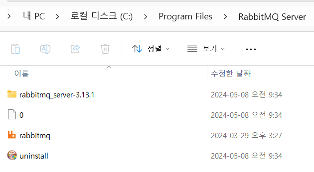 <br><br>
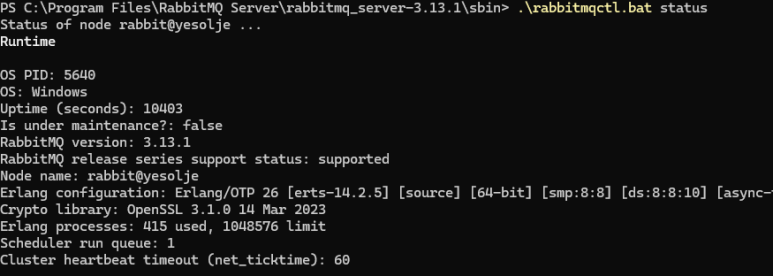 <br><br>
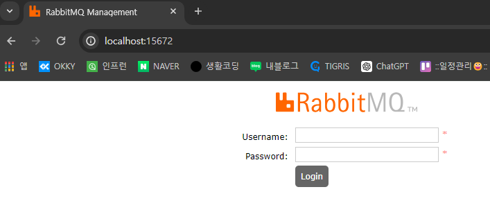 <br> <br>
<br>
```js

## 사용자 리스트 보기
.\rabbitmqctl.bat list_users
## 사용자 추가 (아이디/비밀번호)
.\rabbitmqctl.bat add_user myid mypasswordd
## 관리자 계정 지정
.\rabbitmqctl.bat set_user_tags adteck administrator


```
### 구동
(테스트 환경 : spring boot , gradle) <br>
application.properties 에 rabbitmq 관련 설정을 입력한다. <br>
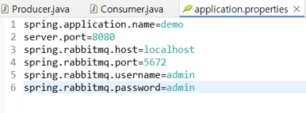 <br><br>
build.gradle 에 dependencies : implementation 'org.springframework.boot:spring-boot-starter-amqp' 를 입력하여 의존성을 추가해준다.<br>
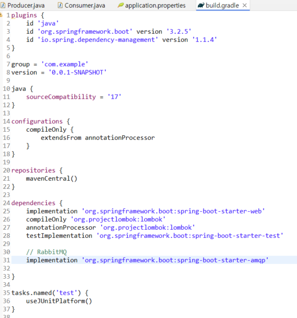 <br><br>
Producer.java class 를 생성한다. 이 클래스에서는 1초마다 메시지를 보낼 수 있게 스케줄링 되어 있다.<br>
```
java
package com.example.demo.msg;

import org.springframework.amqp.rabbit.core.RabbitTemplate;
import org.springframework.beans.factory.annotation.Autowired;
import org.springframework.scheduling.annotation.Scheduled;
import org.springframework.stereotype.Component;

@Component
public class Producer {

    @Autowired
    RabbitTemplate rabbitTemplate;

    @Scheduled(fixedDelay = 1000, initialDelay = 500)
    public void sendMessage(){
        rabbitTemplate.convertAndSend("hello", "XXX sendMessage");
    }
}

```
<br><br>
Consumer.java class 를 생성한다. 이 클래스는 queue 에서 온 메시지를 받는다.<br>
```
java
package com.example.demo.msg;
import org.slf4j.Logger;
import org.slf4j.LoggerFactory;
import org.springframework.amqp.core.Message;
import org.springframework.amqp.rabbit.annotation.RabbitListener;
import org.springframework.stereotype.Component;

@Component
public class Consumer {
	private static final Logger log = LoggerFactory.getLogger(Consumer.class);

	// hello 큐의 메시지가 컨슘되는지 확인하기위해 로그 추가
    @RabbitListener(queues = "hello")
    public void consume(Message message){
        log.info("consumer consumes message: {}",message);
    }
}
//log.info 전문 :Body:'XXX sendMessage' MessageProperties [headers={}, contentType=text/plain, contentEncoding=UTF-8, contentLength=0, receivedDeliveryMode=PERSISTENT, priority=0, redelivered=false, receivedExchange=, receivedRoutingKey=hello, deliveryTag=5, consumerTag=amq.ctag-aj5XHx6copYCjlPI0tw4Bw, consumerQueue=hello]
```
<br><br>
application 실행 시 잘 돌아감을 확인할 수 있다.<br>
 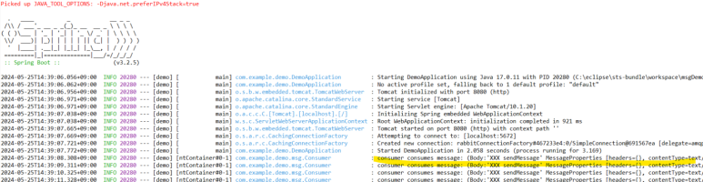<br>
위 예시에서 rabbitmqtemplate 클래스의 convertAndSend 메소드가 메시지 전송에 있어서 중요한 역할을 하는 것을 볼 수 있다. 여기서 routingKey 는 queue 와 바인딩 되는 키 값을 말한다. <br>
rabbitTemplate.convertAndSend(EXCHANGE_NAME,"myroutingkey", "MessageXX");<br>
비즈니스에서는 이와 같이 exchange와 routingkey 를 명시하여 사용하기도 하며 bind 규칙을 order.coffee.# 과 같이 선언하여 topic 타입을 사용할 수도 있다.<br>
 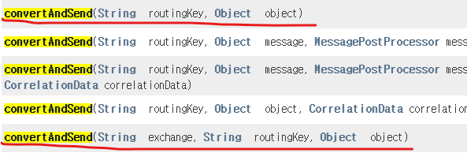<br>
  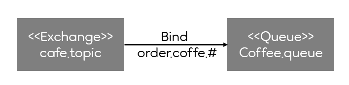<br>
<br><br><br>
### 4. 다른 메시지 큐 시스템 : 아파치 카프카, activemq 무엇이 다른가?

activemq 는 java 에서 채택한 메시지 지향 미들웨어이다. 

카프카는 이벤트 브로커이다. 기본 메시징 시스템(rabbitMQ, ActiveMQ)에서는 브로커(Broker)가 컨슈머(consumer)에게 메시지를 push해 주는 방식인데, 카프카는 컨슈머(Consumer)가 브로커(Broker)로부터 메시지를 직접 가져가는 PULL 방식으로 동작하기 때문에 최적의 성능을 낼 수 있어 대용량 처리에 특화되어있다.
