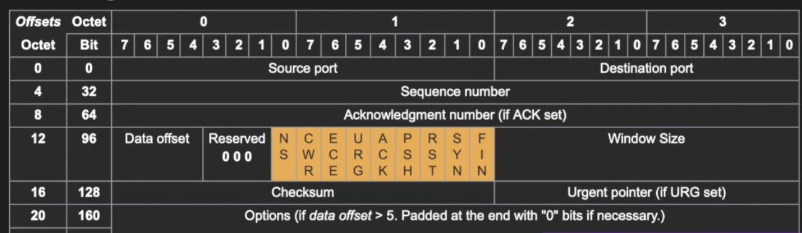

### TCP(Tansmission Control Protocol)란?
- TCP는 인터넷 프로토콜 스위트의 핵심 프로토콜 중 하나로, 신뢰성 있는 데이터 전송을 보장하는 연결형 프로토콜입니다.
- 데이터의 순서를 유지하고 손실된 패킷을 재전송하여 안정적인 통신을 제공합니다.

### TCP 헤더 구조:

- Source Port: 송신자의 포트 번호
- Destination Port: 수신자의 포트 번호
- Sequence Number: 데이터의 순서를 추적하기 위한 번호
- Acknowledgment Number: 수신한 데이터의 확인 번호
- Data Offset: TCP 데이터의 시작되는 위치, 헤더가4라면 offset은 5
- Control Flags: TCP 연결 상태를 제어하기 위한 플래그 (예: SYN, ACK, FIN 등)
  - URG: Urgent Pointer(긴급 포인터) 필드에 값이 채워져있음을 알리는 플래그. 이 포인터가 가리키는 긴급한 데이터는 높게 처리되어 먼저 처리된다. 요즘에는 많이 사용되지 않는다.
  - ACK: Acknowledgment(승인 번호) 필드에 값이 채워져있음을 알리는 플래그. 이 플래그가 0이라면 승인 번호 필드 자체가 무시된다.
  - PSH: Push 플래그. 수신 측에게 이 데이터를 최대한 빠르게 응용프로그램에게 전달해달라는 플래그이다. 이 플래그가 0이라면 수신 측은 자신의 버퍼가 다 채워질 때까지 기다린다. 즉, 이 플래그가 1이라면 이 세그먼트 이후에 더 이상 연결된 세그먼트가 없음을 의미하기도 한다.
  - RST: Reset 플래그. 이미 연결이 확립되어 ESTABLISHED 상태인 상대방에게 연결을 강제로 리셋해달라는 요청의 의미이다.
  - SYN: Synchronize 플래그. 상대방과 연결을 생성할 때, 시퀀스 번호의 동기화를 맞추기 위한 세그먼트임을 의미한다.
  - FIN: Finish 플래그. 상대방과 연결을 종료하고 싶다는 요청인 세그먼트임을 의미한다.
  - etc.. 더 있을수 아래는 혼잡제어를 위한 플래그
  - ECE: ECN Echo 플래그. 해당 필드가 1이면서, SYN 플래그가 1일 때는 ECN을 사용한다고 상대방에게 알리는 의미. SYN 플래그가 0이라면 네트워크가 혼잡하니 세그먼트 윈도우의 크기를 줄여달라는 요청의 의미이다.
  - CWR: 이미 ECE 플래그를 받아서, 전송하는 세그먼트 윈도우의 크기를 줄였다는 의미이다.
  - NS: ECN에서 사용하는 CWR, ECE 필드가 실수나 악의적으로 은폐되는 경우를 방어하기 위해 RFC 3540에서 추가된 필드
    - RFC RFC 3540은 RTP (Real-time Transport Protocol)에 대한 명세서, RFC 3540은 RTP 세션에 속한 다중 스트림을 지원하기 위한 RTP 중복 제거를 다룹니다.
- Window Size: 수신자가 현재 받을 수 있는 최대 데이터 양
- Checksum: 오류 검출을 위한 체크섬 값
- Urgent Pointer: 긴급 데이터의 위치를 가리키는 포인터, 1이면 우선처리
- Options: TCP 옵션 (선택적)

### TCP의 3-way Handshake:

1. 클라이언트가 서버에게 연결 요청을 보내기 위해 SYN 패킷을 전송합니다. 이때 Sequence Number를 랜덤하게 선택합니다.
2. 서버는 클라이언트에게 SYN-ACK 패킷을 전송하여 연결 요청을 수락한다는 응답을 합니다. 이때 자신의 Sequence Number를 선택하고, 클라이언트의 Sequence Number에 n을 더한 값을 Acknowledgment Number로 설정합니다.
3. 클라이언트는 서버에게 ACK 패킷을 전송하여 연결이 수립되었음을 확인합니다. 이때 서버의 Sequence Number에 n을 더한 값을 Acknowledgment Number로 설정합니다.

이렇게 3-way handshake가 완료되면 TCP 연결이 설정되고, 데이터의 안정적인 전송이 이루어집니다.

