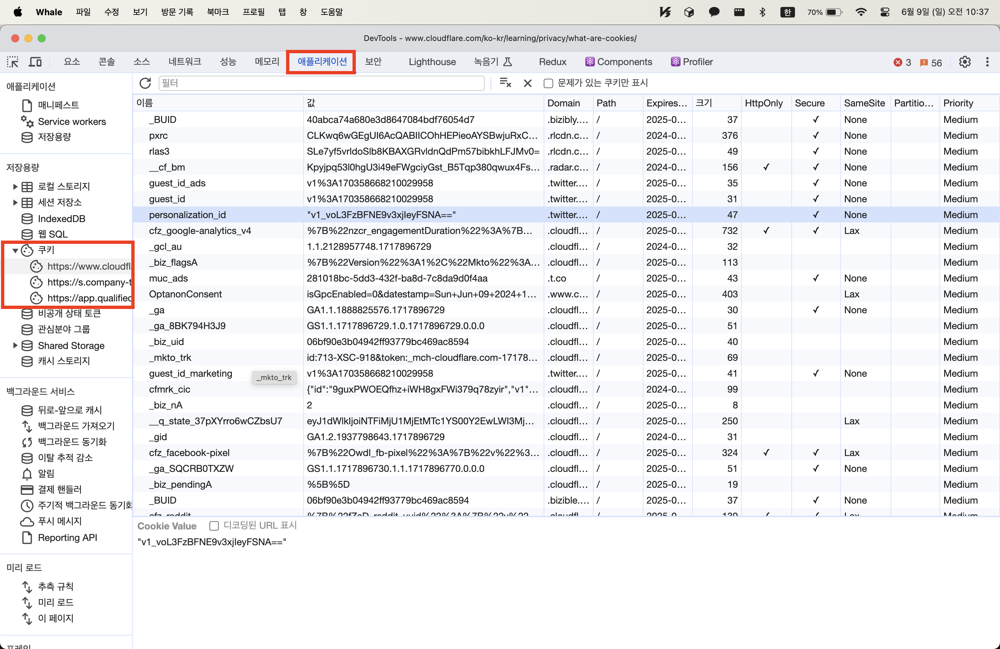
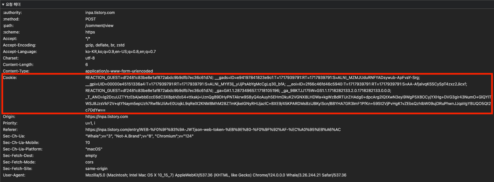
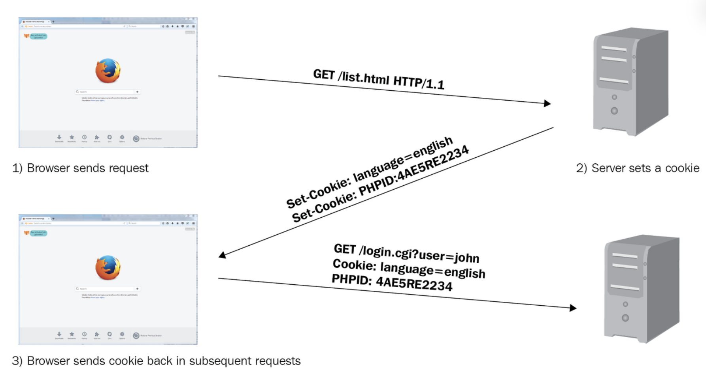
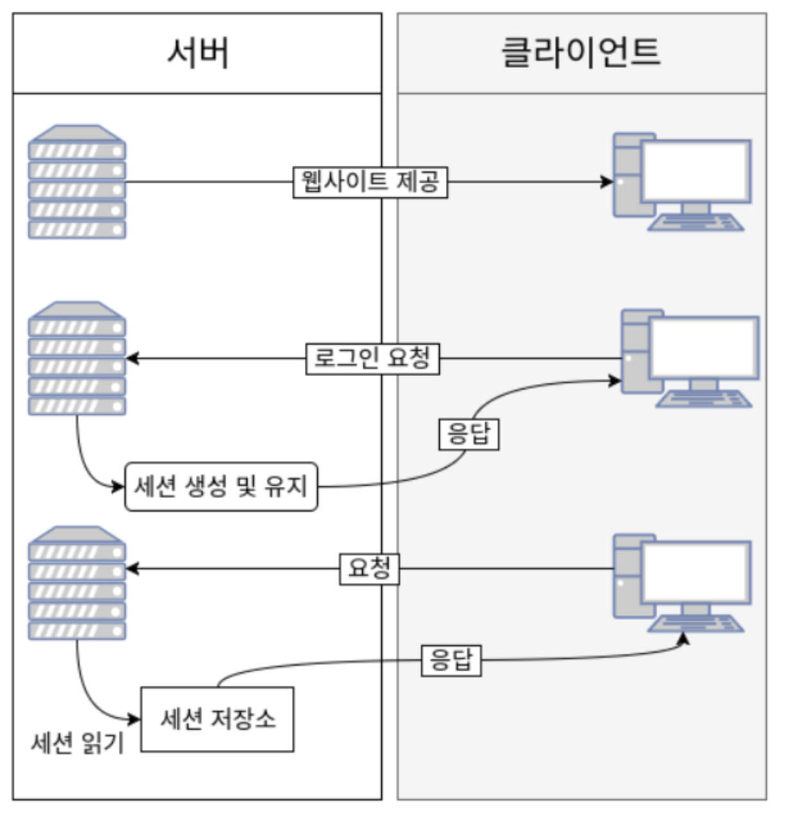
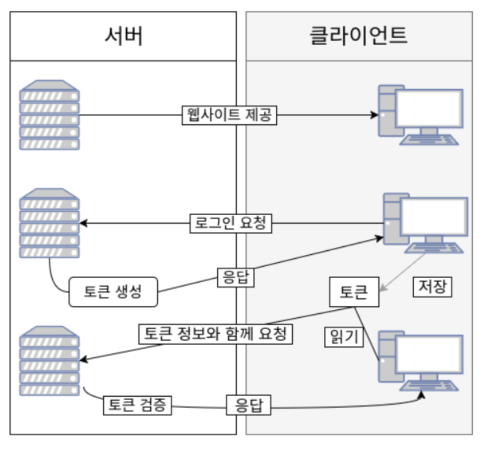
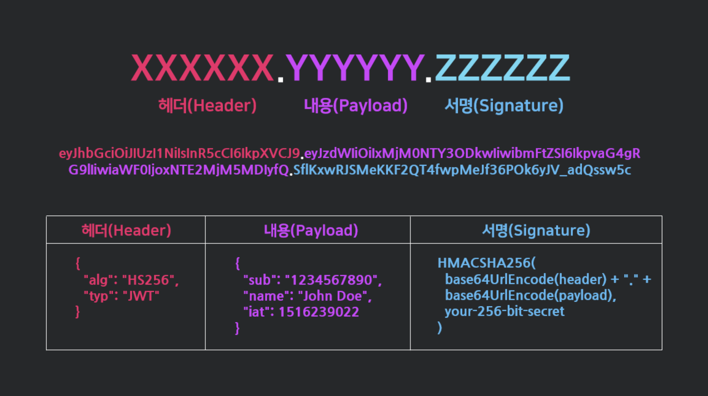
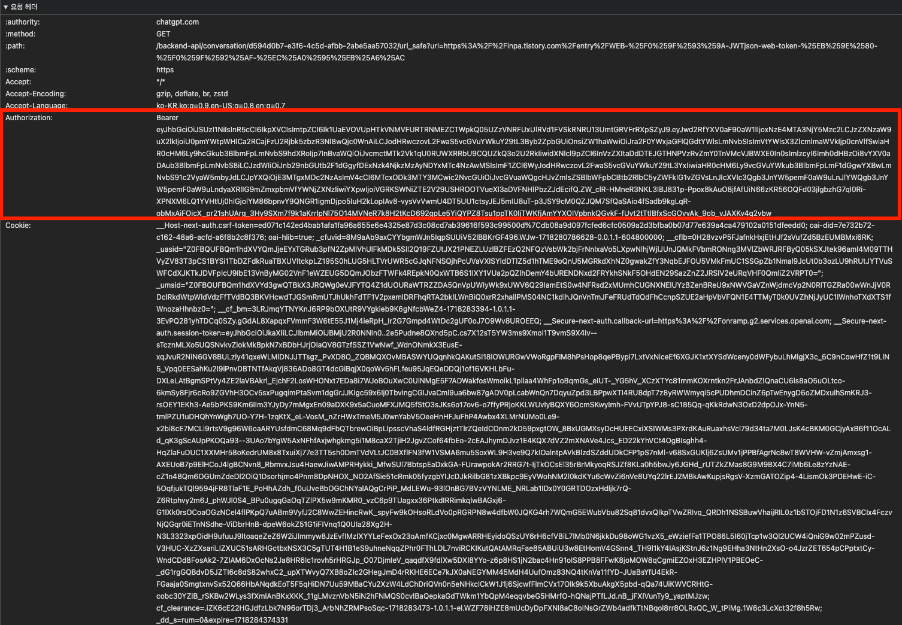

# 웹 보안

## Token vs Cookie

### 쿠키 기반 인증

쿠키는 웹 서버가 생성하여 웹 브라우저로 전송하는 작은 정보 파일입니다. 웹 브라우저는 수신한 쿠키를 미리 정해진 기간 동안 또는 웹 사이트에서의 사용자 세션 기간 동안 저장합니다. 웹 브라우저는 향후 사용자가 웹 서버에 요청할 때 관련 쿠키를 첨부합니다.

쿠키는 HTTP 프로토콜의 일부로 브라우저가 자동으로 HTTP 요청에 포함시켜 전송합니다.

`우선 쿠키는 어디에서 찾아볼 수 있을까?`

브라우저 > 개발자 도구 > 애플리케이션 > 쿠키

`쿠키는 어떤 정보들을 가지고 있는가?`

- **이름 (Name)** : 쿠키의 식별자.
- **값 (Value)** : 쿠키에 저장되는 데이터.
- **만료 날짜 (Expiration Date)** : 쿠키의 유효 기간. 이 날짜 이후에는 쿠키가 삭제됩니다.
- **경로 (Path)** : 쿠키가 유효한 URL 경로. 특정 경로에만 쿠키가 전송됩니다.
- **도메인 (Domain)** : 쿠키가 유효한 도메인. 지정된 도메인 및 하위 도메인에만 쿠키가 전송됩니다.
- **보안 플래그 (Secure Flag)** : 쿠키가 HTTPS 연결에서만 전송되도록 설정합니다.
- **HttpOnly 플래그** : 쿠키가 JavaScript를 통해 접근되지 않도록 설정합니다. 이를 통해 XSS(교차 사이트 스크립팅) 공격을 방지할 수 있습니다.
- **SameSite 플래그** : 쿠키의 사이트 간 요청 전송 방식을 제어합니다. 이 플래그는 CSRF(교차 사이트 요청 위조) 공격을 방지하는 데 유용합니다.

`쿠키의 종류`

- **세션 쿠키 (Session Cookie)**: 브라우저 세션이 종료되면 자동으로 삭제됩니다. 주로 로그인 상태와 같은 일시적인 정보를 저장하는 데 사용됩니다. 만료일이 세션으로 표시된 쿠키이다.

- **영구 쿠키 (Persistent Cookie)**: 만료 날짜가 설정된 쿠키로, 브라우저가 종료된 후에도 지정된 기간 동안 유지됩니다. 사용자의 설정이나 로그인 정보를 장기적으로 저장하는 데 사용됩니다. 만료일이 설정되어 있는 쿠키이다.

- **서드 파티 쿠키 (Third-Party Cookie)**: 사용자가 방문한 웹 사이트와 다른 도메인에서 설정한 쿠키입니다. 주로 광고 및 트래킹 목적으로 사용됩니다. A 라는 도메인에 쿠키가 심어져 있지만 도메인 값이 B 로 설정되어 있는 쿠키이다.

`쿠키의 크기 제한`

- 단일 쿠키 크기 : 대부분의 브라우저는 단일 쿠키의 크기로 최대 4KB (4096 bytes) 로 제한
- 도메인 당 최대 크기 개수 : 대부분의 브라우저는 하나의 도메인에서 최대 20 ~ 50 개의 쿠키를 허용

`쿠키 기반 인증의 장단점`

| **장점**                                                                                               | **단점**                                                                                      |
|------------------------------------------------------------------------------------------------------|---------------------------------------------------------------------------------------------|
| **상태 유지**                                                                                            | **서버 상태 관리**                                                                                |
| 서버가 세션 상태를 관리하여 사용자의 로그인 상태와 같은 정보를 쉽게 유지할 수 있습니다.                                                   | 세션 정보를 서버 메모리 또는 데이터베이스에 저장해야 하므로 서버에 부하가 발생할 수 있습니다. 이는 특히 확장성이 필요한 애플리케이션에서 문제가 될 수 있습니다. |
| **단순한 구현**                                                                                           | **확장성**                                                                                     |
| 많은 웹 프레임워크와 서버가 세션 관리를 기본적으로 지원하므로 구현이 비교적 단순합니다.                                                    | 서버가 세션 상태를 유지해야 하기 때문에, 서버 간의 세션 동기화가 필요하며, 이는 분산 시스템에서 복잡성을 증가시킵니다.                        |
| **보안 기능**                                                                                            | **세션 탈취**                                                                                   |
| 쿠키에 `HttpOnly`, `Secure`, `SameSite` 플래그를 설정하여 XSS(교차 사이트 스크립팅) 및 CSRF(교차 사이트 요청 위조) 공격을 방지할 수 있습니다. | 세션 ID가 탈취되면 공격자는 해당 세션을 가장하여 인증된 사용자로 행동할 수 있습니다. 따라서 세션 ID를 안전하게 관리하는 것이 중요합니다.            |
| **자동 전송**                                                                                            | **쿠키 크기 제한**                                                                                |
| 쿠키는 HTTP 요청 헤더에 자동으로 포함되어 서버로 전송되므로, 클라이언트 측에서 추가 작업이 필요 없습니다.                                       | 쿠키의 크기 제한(일반적으로 4KB)은 저장할 수 있는 정보의 양을 제한합니다. 쿠키의 크기가 클수록 네트워크에 부하가 심해진다.                    |
|                                                                                                      | **클라이언트 저장소 의존성**                                                                           |
|                                                                                                      | 쿠키는 클라이언트의 브라우저에 저장되므로, 클라이언트가 쿠키를 삭제하거나 차단하면 인증이 제대로 동작하지 않을 수 있습니다.                       |

`HTTP 요청의 일부분인 쿠키`

 

### 토큰 기반 인증

`토큰 기반의 인증 시스템은 왜 등장했는가?`

- 쿠키 기반 인증

가장 전통적인 방식의 인증 시스템은 쿠기 기반으로 인증을 진행하는 것이다.

앞서 살펴봤듯이 쿠키는 브라우저에 심어져 있는 key-value 로 이루어져있는 작은 정보 덩어리이다.

사용자의 정보를 쿠키에 담아두어 클라이언트에서 저장하고 있고 Http 요청에 자동으로 쿠키에 담긴 정보가 포함되어 있기 때문에 사용자를 특정할 수 있고 다시 인증을 할 필요가 없는 것이다.

- 세션 기반 인증

쿠키에 사용자의 정보들을 담아서 저장하게 되면 민감한 정보들이 유출될 수도 있고 조작당할 수 있다.

이러한 이유로 민감한 정보들은 서버 측에 세션이라는 영역에 저장하고 여러가지 정보들을 조합해서 암호화한 SessionId 를 쿠키에 담아서 클라이언트에 저장하고 이를 서버에서 저장하고 있는 값과 비교하여 인증을 수행한다. 

- 토큰 기반 인증

세션 기반 인증은 사용자에 대한 정보들을 서버 (메모리, 데이터베이스, etc) 에서 저장하고 관리한다. 

사용자가 이용하는 동안 해당 정보를 계속해서 유지해야하기 때문에 동시에 이용하는 사용자가 많아질 수록 서버에 부담은 커질 수 밖에 없다.

이러한 단점을 극복하기 위해 토큰 기반의 인증 시스템이 등장했다. 

 

`토큰이란 무엇인가?`

토큰도 쿠키와 비슷하게 어떤 정보의 모음이다.

SAML, OAuth 등 다양한 형태의 토큰이 존재하지만 가장 일반적으로 사용되는 형태는 JWT(Json Web Token) 이다.

`토큰과 쿠키의 차이점`

| **구분**     | **토큰 (Tokens)**                      | **쿠키 (Cookies)**                                          |
|------------|--------------------------------------|-----------------------------------------------------------|
| **저장 위치**  | 클라이언트 측 (로컬 스토리지, 세션 스토리지 등)         | 클라이언트 측 (브라우저에 저장)                                        |
| **전달 방식**  | 클라이언트가 HTTP 요청 헤더에 직접 포함             | 브라우저가 HTTP 요청 헤더에 자동으로 포함                                 |
| **보안**     | XSS에 취약, CSRF에 강함                    | XSS, CSRF에 취약하지만 HttpOnly, Secure, SameSite 속성으로 보안 강화 가능 |
| **세션 관리**  | 무상태 (Stateless) 방식, 서버에서 상태를 저장하지 않음 | 상태 기반 (Stateful) 방식, 서버에서 세션 상태를 관리함                      |
| **사용 편의성** | 클라이언트에서 직접 관리, 추가 코드 필요              | 브라우저가 자동 관리, 설정 및 사용이 간단함                                 |
| **형식**     | JWT, Opaque 토큰 등 다양한 형식              | 단순한 키-값 쌍                                                 |
| **위변조 방지** | JWT의 경우 서명 포함, Opaque 토큰의 경우 서버에서 검증 | 서버에서 세션 ID를 관리하여 위변조 방지                                   |
| **사용 사례**  | API 인증, 모바일 애플리케이션                   | 웹 애플리케이션에서 세션 관리 및 인증                                     |

 

`JWT`

JWT (Json Web Token) 은 위의 사진과 같이 헤더, 내용, 서명을 마침표를 기준으로 구분되어 있는 문자열이다. 

JWT 는 JSON 데이터를 Base64 URL-safe Encode 를 통해 인코딩하여 직렬화한 것이며 토큰 내부에 위변조 방지를 위해 개인키를 통한 전자서명이 포함되어 있다.

> **Base URL-safe Encode**
> 
> Base 64 인코딩은 이진 데이터를 텍스트로 변환하는 인코딩 방식. 
> 
> 주로 바이너리 데이터를 텍스트 형태로 안전하게 전송하기 위해 사용.
> 
> 64개의 ASCII 문자를 사용하여 데이터의 크기를 4:3 비율로 증가시킴. 이를 통해 바이너리 데이터를 이메일, URL, JSON 등 텍스트 전송에 적합한 형태로 변환
> 
> 일반적인 Base64 Encode 에서 URL 에서 오류없이 사용하도록 '+', '/' 를 각각 '-', '_' 로 표현한 것

- 헤더 (Header)
  - 토큰 유형, 서명 암호화 알고리즘 정보를 담고 있다. 
- 내용 (Payload)
  - 사용자에 대한 정보들을 저장합니다. 기존 쿠키, 세션에 저장하던 유저에 대한 정보를 저장합니다.
- 서명 (Signature)
  - header, payload, 서버가 가지고 있는 비밀키를 합쳐서 헤더에 정의된 알고리즘으로 암호화를 한 값

> **유의사항**
> 
> 1. Header 와 Payload 는 단순히 인코딩된 값이 때문에 디코딩하면 값을 알 수 있지만 서명은 서버의 비밀키가 없으면 복호화할 수 없기 때문에 위변조 여부를 확인하는데 사용된다.
> 2. Payload 는 단순히 인코딩된 값이기 때문에 비밀번호와 같은 민감한 정보를 포함하고 있으면 안된다. 

 

`JWT 인증 방식의 장단점`

| 장점                                                     | 단점                                       |
|--------------------------------------------------------|------------------------------------------|
| Header 와 payload 를 가지고 서명을 생성해 데이터 위변조를 막을 수 있다        | 정보가 많아지면 토큰 길이가 길어져 네트워크 부하가 발생할 수 있음    |
| 인증 정보를 별도의 저장소에 저장하고 있을 필요 없음                          | Payload는 BASE64 인코딩된 것이므로 중요 데이터를 담기 어려움 |
| 토큰에 대한 정보와 토큰을 통해 전달할 정보, 검증됬음을 증명하는 서명을 자체적으로 가지고 있다. | 토큰 자체를 탈취당하면 대처하기 어려움                    |
| 서버가 무상태(Stateless)여서 확장성이 우수                           | 클라이언트에서 요청에 토큰을 포함시키는 작업 필요              |
| 다른 로그인 시스템에 접근 및 권한 공유 가능                              |                                          |
| 모바일 어플리케이션 환경에서도 잘 동작                                  |                                          |

 

`토큰이 HTTP 요청에 포함되는 방법`

1. Authorization Header (Bearer Token)

2. URL 파라미터로 전달

3. 쿠키로 전달 

`Access Token, Refresh Token`

위에서 살펴본 토큰을 탈취당하면 보안상의 문제가 발생할 수 있다. 때문에 Access Token, Refresh Token 두 가지 토큰을 통해서 단점을 보완한다.

둘 다 JWT 형식을 취하는 것은 같지만 어디에 저장되고 관리되느냐에 따른 차이뿐이다.

- Access Token : 클라이언트가 갖고 있는 실제로 유저의 정보가 담긴 토큰으로, 클라이언트에서 요청이 오면 서버에서 해당 토큰에 있는 정보를 활용하여 사용자 정보에 맞게 응답을 진행
- Refresh Token : 새로운 Access Token 은 접근에 관여하는 토큰, Refresh Token 은 재발급에 관여하는 토큰의 역할로 사용되는 토큰이다.

> 토큰의 유효 기간을 부여하여 탈취 문제에 대응을 할 수도 있지만 유효 기간을 짧게 설정할 경우 로그인을 그 때마다 해야하기 때문에 유저의 편의성을 해칠 수 있다.
> 
> 때문에 Refresh Token 을 통해 일정 기간 이후 자동으로 토큰을 갱신하도록 하여 보안을 강화하는 방식을 많이 사용한다. 

> **참고**
>
> [쿠키란? - 클라우드플레어](https://www.cloudflare.com/ko-kr/learning/privacy/what-are-cookies/)
>
> [토큰 기반 인증이란? - 클라우드플레어](https://www.cloudflare.com/ko-kr/learning/access-management/token-based-authentication/)
>
> [JWT 토큰 인증이란?](https://inpa.tistory.com/entry/WEB-%F0%9F%93%9A-JWTjson-web-token-%EB%9E%80-%F0%9F%92%AF-%EC%A0%95%EB%A6%AC)