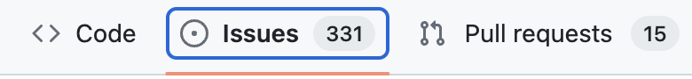
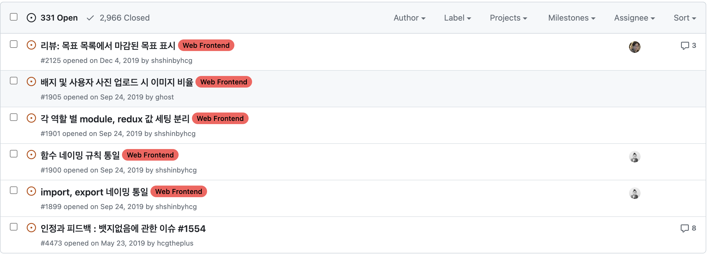
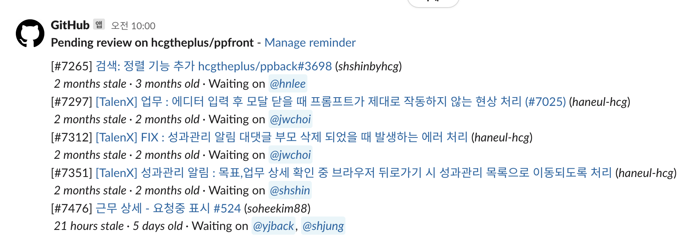
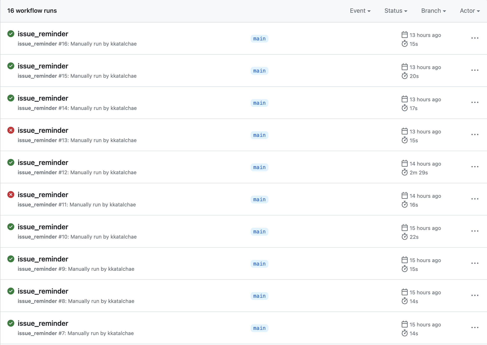
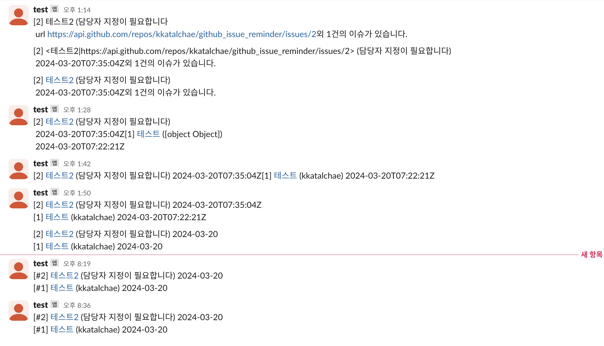

## Github Issue Reminder 

깃허브 이슈를 상기시키는 메시지를 발송시키는 봇

### 왜 이슈 리마인더를 만들었는가?

이 쌓여있는 이슈들은 정말로 우리 서비스에 존재하는 이슈들이 맞을까? 

그렇다면 왜 고쳐지지 않고 방치되어 있는가? 기존에는 어떻게 관리하고 있으며 관리해야 한다. 라는 마음으로 시작 !

그렇다면 슬랙으로 리마인딩을 해주면 어떨까? 마치 PR 을 리마인드 하고 있듯이?

`팀원들이 생각하고 있는 이슈관리 문제점`
- 스프린트 과제와 이슈 해결 과제가 동시에 존재
- 스프린트 과제 배분을 받으면 이슈 해결 리소스가 없음
- 이슈 해결의 중요도에 비해 리소스가 많이 드는 경우
- 이슈가 존재함은 알고 있으나 과제에 비해 우선순위가 명확히 떨어짐
- 나중에 했으면 좋겠다하는 부분(ex - 리팩토링), 테스트 케이스 명세 등이 혼재되어 있음

### 어떤 방식으로 리마인딩을 해야할까?

`해결 방안`
- Assignee 필수 지정
- 정해진 기간마다 해결되지 않은 이슈 리스팅
- 이슈 상태에 따른 분류 ( 라벨링 )
- 너무 많은 데이터인 경우 처리 ( x건까지는 보여주고 나머지는 외 x건으로 리포팅 )
- 이슈 정렬 ( 우선 순위 순, 오래된 순 )

`라벨링 규칙`
- 우선순위에 대한 라벨링
    - 아이젠하워 메트릭스 ( 중요도, 긴급도에 따른 분류 )
    - 모스코우 프레임워크 ( 기능의 서비스 내 필수 정도에 따른 분류 )
- 과제, 체크리스트, 이슈에 대한 카테고리에 대한 라벨링
    - 과제, 체크리스트는 리포팅 하지 않는다.

### 어떻게 만들까?

첫 번째 방법은 깃허브에서 PR 은 리마인더라는 기능으로 제공하고 있는데 이슈도 제공하지 않을까?

=> 생긴지 오래된 기능이 아니라 아직 제공하지 않는다. 아마 추후에 기능이 생기지 않을까?

두 번째 방법은 `zapier` 라는 업무 자동화 툴을 통해서 깃허브 이슈들을 가져와서 슬랙 메시지로 보내는 방법이다.

=> 하지만 깃허브 이슈를 가져올 때 하나씩 가져와서 메시지를 보내야하고 원하는대로 커스터마이징이 어렵다는 단점이 있어서 제외하였다.

세 번째 방법은 `GitHub Actions` 를 이용하여 지정된 시간에 깃허브 API 를 통해 깃허브 이슈들을 가져와서 슬랙 API 를 이용해서 메시지를 보내는 스크립트를 실행시키는 방법이다.

=> 자유도가 높고 GitHub Actions 를 사용해보고 싶어서 해당 방법을 사용하였다. 

### 개발 기록

[이슈 리마인더 깃허브](https://github.com/kkatalchae/github_issue_reminder)

`깃허브 액션 시도들`

`슬랙 메시지 테스트`

> **참고 글**
> 
> [깃허브 액션을 통한 리마인더 만들기](https://godsenal.com/posts/github-action%EC%9C%BC%EB%A1%9C-%EB%A6%AC%EB%A7%88%EC%9D%B8%EB%8D%94-%EB%A7%8C%EB%93%A4%EA%B8%B0/)
> 
> [슬랙 API 문서 > 메시지 보내기](https://api.slack.com/methods/chat.postMessage#text_usage)
> 
> [깃허브 API > Octokit (Node.js) 기반 > 이슈 가져오기](https://github.com/octokit/octokit.js)
> 
> [크론탭 시간 설정 관련](https://velog.io/@jay2u8809/Crontab%ED%81%AC%EB%A1%A0%ED%83%AD-%EC%8B%9C%EA%B0%84-%EC%84%A4%EC%A0%95)