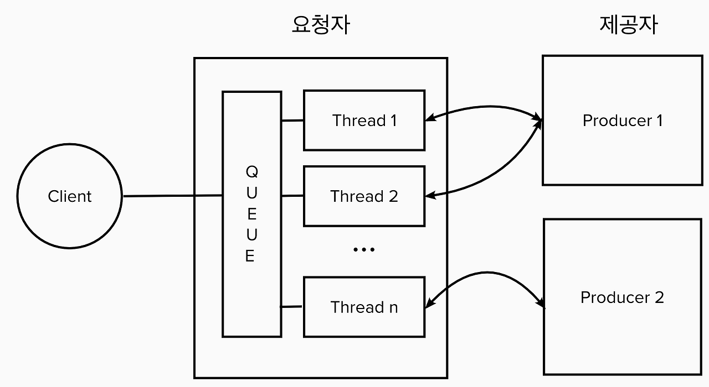
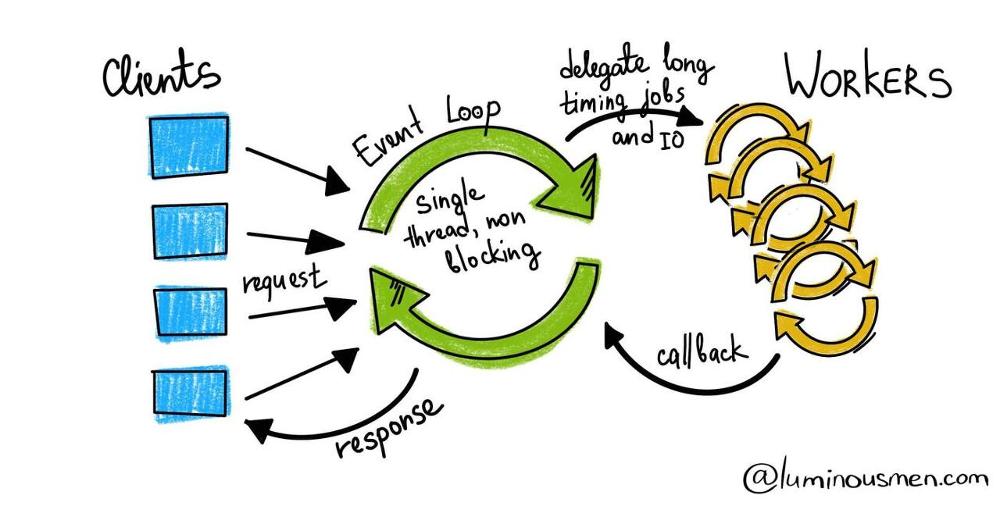
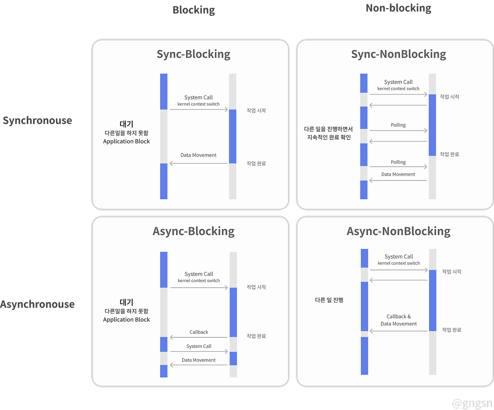

# Feign Client

## 개념

---

- HTTP 클라이언트를 간편하게 작성할 수 있도록 도와주는 라이브러리이다.
- Netflix 에서 개발되었으며 스프링 클라우드에서 공식적으로 지원하게 되었다.
- Spring Boot 1.2.x 버전부터 사용할 수 있다.

## Spring 에서 HTTP 클라이언트를 작성하는 방법들

---

### Rest Template

- Spring 3.0 부터 지원하는 스프링의 HTTP 통신 템플릿
- Restful 형식에 맞춰진 템플릿
- Multi Thread && Blocking 방식



요청이 들어오면 요청은 큐에 쌓인다.

가용할 수 있는 스레드가 있으면 요청을 스레드에 할당하여 요청을 처리한다.

요청이 스레드에 할당되면 응답을 반환할 때까지 스레드를 점유하고 있는다.

요청이 순차적으로 발생할 때는 문제가 생기지 않지만 여러 개의 요청이 동시에 발생했을 때 가용한 스레드가 없다면 문제가 된다.

### WebClient

- Non-blocking 방식
- Spring WebFlux 에서 HTTP client 로 사용



각 요청은 Event Loop 에 Job 으로 등록된다.

각 Job 을 제공자에게 할당하고 응답을 기다리지 않고 다른 Job 을 처리한다.

제공자로부터 응답 (callback) 이 오면 요청자에게 제공한다.

WebClient 는 이벤트에 반응하여 동작하도록 설계되었다.

`Async vs Sync / Blocking vs Non-Blocking`



## OpenFeign

---

Feign Client 는 기본적으로 자바의 `HttpURLConnection` 을 사용해서 HTTP 요청을 수행한다.

`Rest Template` 과 같이 `Blocking` 방식으로 동작하며 기본적으로는 `non-blocking` 방식을 지원하지는 않는다.

`spring-cloud` 프로젝트의 `loadbalencer`, `Eureka`, `circuit-breaker` 와 통합이 쉬워 많은 요청이 동시에 발생하는 경우에 대해 보완할 수 있다.

또한, `Spring WebFlux` 와 통합하여 `non-blocking` 방식으로 비동기 HTTP 요청을 보낼 수도 있다.

### 장점

- 어노테이션을 활용해서 간단하게 외부로 HTTP 요청을 보낼 수 있다.
- 다른 Spring Cloud 기술들(Eureka, Circuit Breaker, LoadBalancer) 과의 통합이 쉽다.

### 단점

- 기본 Http Client가 Http2를 지원하지 않음 -> http client 를 okHttpClient 로 변경
- 공식적으로 Reactive 모델을 지원하지 않음
- 테스트 도구를 제공하지 않음

> **HTTP2**
>
> **HTTP/2**는 웹 트래픽을 효율적으로 전송하기 위해 설계된 HTTP의 2세대 프로토콜입니다.
>
> HTTP/1.1과 비교하여 다음과 같은 주요 개선 사항을 제공합니다
>
> - **멀티플렉싱:** 하나의 TCP 연결을 통해 여러 요청과 응답을 동시에 전송할 수 있습니다. 이로 인해 TCP 헤드를 줄이고 네트워크 효율성을 높일 수 있습니다.
> - **헤더 압축:** 헤더 정보를 압축하여 전송량을 줄일 수 있습니다.
> - **응답 응답 병렬화:** 여러 요청에 대한 응답을 동시에 전송할 수 있습니다.
> - **서버:** 서버가 클라이언트에게 필요한 자원을 미리 전송할 수 있습니다.
>
> **HTTP/2의 장점:**
>
> * **빠른 로딩 속도:** 멀티플렉싱과 헤더 압축을 통해 페이지 로딩 속도를 향상시킬 수 있습니다.
> * **낮은 네트워크 사용량:** 데이터 전송량을 줄여 네트워크 효율성을 높일 수 있습니다.
> * **안정적인 연결:** TCP 연결을 더 효율적으로 관리하여 연결이 끊기는 것을 방지할 수 있습니다.

### OpenFeign 설정

기준 버전 : `spring-cloud-starter-openfeign version 4.0.4`

OpenFeign 의 설정은 YAML, java 두 가지 모두 지원하며 YAML 이 자바보다 우선순위를 가진다.

`@Configuration` 어노테이션을 사용하면 구현하고 있는 `FeignClient` 모두에 동일한 설정이 적용되니 이 점에 유의하여 사용하자.

`@Configuration` 어노테이션으로 구현되어있는 기본 설정을 사용하지 않고 예외적으로 처리하려면 FeignClient 에 configuration 옵션을 주면 된다.

e.g : `@FeignClient(value = "customConfig", url = "$", configuration = )`

`Log 설정`

OpenFeign 의 로그 설정은 DEBUG 만 사용가능하다. (INFO, ERROR 등으로 설정불가)

기본적으로 NONE, BASIC, HEADERS, FULL 네 가지 옵션을 제공한다.

- NONE : HTTP 요청에 대한 로그를 출력하지 않는다 (기본값)
- BASIC : 요청 메소드와 URL, 응답의 상태코드, 실행 시간만 제공
- HEADERS : 요청과 응답에 대한 헤더만 제공
- FULL : 요청과 응답에 대한 headers, body, metadata 에 대한 모든 것을 제공

```
// Java Config
@Configuration 
@EnableFeignClients("com.example.openfeign")
class OpenFeignConfig {

    @Bean
    Logger.Level feignLoggerLevel() {
        return Logger.Level.FULL;
    }
}

// application.yml
logging.level.project.user.UserClient: DEBUG


출처: https://mangkyu.tistory.com/279 [MangKyu's Diary:티스토리]
```

`http client 설정`

```yaml
// okHttpClient
spring.cloud.openfeign.okhttp.enabled = true

// Apache Http Client 5
spring.cloud.openfeign.httpclient.hc5.enabled = true
```


`openFeign 에서 기본적으로 제공하는 Bean`

| 분야                              | 객체                                | 비고                                                                                                           |
|---------------------------------|-----------------------------------|--------------------------------------------------------------------------------------------------------------|
| Decoder                         | `ResponseEntityDecoder`           | SpringDecoder를 래핑합니다.                                                                                        |
| Encoder                         | `SpringEncoder`                   |                                                                                                              |
| Logger                          | `Slf4jLogger`                     | SLF4j 기반 로그를 사용합니다.                                                                                          |
| MicrometerObservationCapability | `MicrometerObservationCapability` | feign-micrometer 가 클래스패스에 있고 ObservationRegistry 가 사용 가능한 경우 제공됨                                             |
| MicrometerCapability            | `MicrometerCapability`            | feign-micrometer 가 클래스패스에 있고 MeterRegistry 가 사용 가능하며 ObservationRegistry 가 사용 가능하지 않은 경우 제공됨                 |
| CachingCapability               | `CachingCapability`               | @EnableCaching 애노테이션이 사용된 경우 제공됨. spring.cloud.openfeign.cache.enabled 을 통해 비활성화 가능                          |
| Contract                        | `SpringMvcContract`               | Spring MVC API 를 위한 기본 인터페이스를 제공합니다.                                                                         |
| Builder                         | `Feign.Builder`                   | Feign Client 를 구성하는 데 사용됩니다.                                                                                 |
| Feign.Builder                   | `FeignCircuitBreaker.Builder`     | Feign Circuit Breaker 를 사용하여 API 호출 실패를 관리합니다.                                                               |
| Client                          | `FeignBlockingLoadBalancerClient` | Spring Cloud LoadBalancer 가 클래스패스에 있는 경우 FeignBlockingLoadBalancerClient 가 사용됨. 그렇지 않으면 기본 Feign 클라이언트가 사용됨. |

`기본적으로 제공되지 않는 Bean`

- Logger.Level
- Retryer
- ErrorDecoder
- Request.Options
- Collection<RequestInterceptor>
- SetterFactory
- QueryMapEncoder
- Capability (MicrometerObservationCapability and CachingCapability are provided by default)


## 참고

--- 

> [Rest Template 사용법 관련 글](https://velog.io/@seongwon97/Spring-Boot-Rest-Template)
>
> [Rest Template 개념 관련 글](https://adjh54.tistory.com/234)
>
> [WebClient 이해 관련 글](https://happycloud-lee.tistory.com/220)
> 
> [WebClient 사용 관련 글](https://gngsn.tistory.com/154)
> 
> [WebClient 사용 관련 글2](https://leeggmin.tistory.com/11#WebClient%20Config%20%EC%9E%91%EC%84%B1-1)
>
> [Spring 공식문서 - REST clients](https://docs.spring.io/spring-framework/reference/integration/rest-clients.html#rest-http-interface%5BSpring)
>
> [Spring Cloud OpenFeign 공식 문서](https://docs.spring.io/spring-cloud-openfeign/docs/4.0.4/reference/html/)
>
> [OpenFeign이란?](https://mangkyu.tistory.com/278)
>
> [OpenFeign 커스텀 설정](https://mangkyu.tistory.com/279)
>
> [우아한 기술블로그 - feign 좀 더 나아가기](https://techblog.woowahan.com/2657/)
>
> [토스의 Feign 코드 분석과 성능 개선 사례](https://toss.tech/article/engineering-note-3)