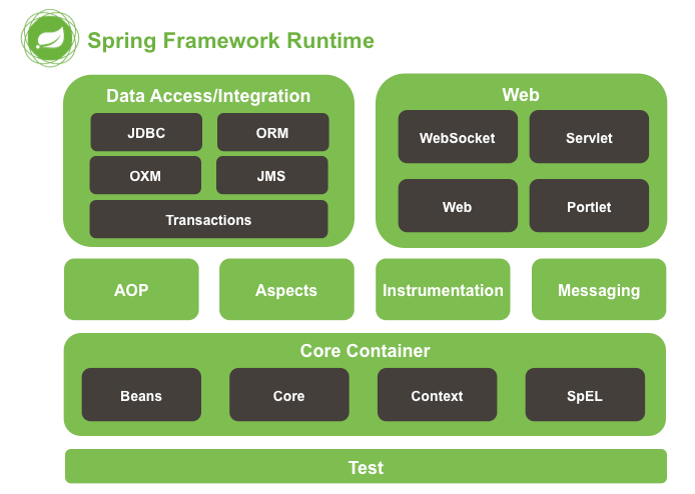

> ### Spring Framework
> 자바 엔터프라이즈 애플리케이션 개발에 사용되는 오픈소스 경량급 애플리케이션 프레임워크   
<br>

### 스프링이 탄생하기 까지..

`EJB(Enterprise Java Bean)` ❄️   

대규모 분산 객체 시스템   
`분산 컴퓨팅` : 하나의 컴퓨터에 존재하는 애플리케이션이나 프로세스에서 혼자 수행하기 어려운 작업을 다중 프로세서나 컴퓨터에 분산 시키는 것   
`분산 객체` : 분산 컴퓨팅 기술이 객체 지향과 접목되어 하나의 프로세서나 컴퓨터에서 실행되는 객체가 다른 프로세서나 컴퓨터에서 객체와 통신이 가능하도록 하는 기술   
<br>

Spring Core?
=
   


### IoC(Inversion of Control) / DI(Dependency Injection)   
> `IoC` : 제어의 역전. 객체의 생성부터 생명 주기를 스프링 컨테이너가 관리한다.   
> `DI` : 의존성 주입. 객체를 직접 생성하는 것이 아닌 외부에서 생성한 후 주입 시켜주는 방법이다.

#### 스프링에서의 IoC
1. 객체 생성
2. 의존성 객체 주입
3. 의존성 객체 메서드 호출


#### DI 방식
*개방 폐쇄 원칙(OCP)의 이점과 같은 이점을 얻을 수 있다.*

1. Setter 메서드 주입
```java
public class MemberService {
  private MemberRepository memberRepository;

  @Autowired
  public void setMemberRepository(MemberRepository memberRepository) {
    this.memberRepository = memberRepository;
  }
```
2. 필드 주입
```java
public class MemberService {
    @Autowired
    private MemberRepository memberRepository;
}
```
3. **생성자 주입**
```java
@RequiredArgsConstructor //final이 붙은 필드에 생성자를 만들어줌, 이 애노테이션만 붙여도 의존 주입이 가능함
public class MemberService {
    
    private final MemberRepository memberRepository;
	
    // RequiredArgsConstructor 애노테이션을 붙이면 주석처럼 생성자를 만들지 않아도 됨
    //@Autowired 생성자가 하나 있을 때 스프링이 알아서 등록을 해줌
    /*public MemberService(MemberRepository memberRepository) {
        this.memberRepository = memberRepository;
    }*/
    
}
```

<br>   

### AOP(Aspect Oriented Programming)   
> `AOP` : 관점 지향 프로그래밍. 어떤 로직을 기준으로 핵심적인 관점, 공통적인 관점(부가적인 관점)으로 나누어서 보고 그 관점을 기준으로 모듈화하겠다는 의미이다.

.png)  

애플리케이션 전반에 걸쳐 공통적으로 사용되는 기능들에 대한 관심사 => `공통 관심 사항(Cross-cutting concern)`이라 부르며,   
애플리케이션의 주목적을 달성하기 위한 핵심 로직에 대한 관심사를 `핵심 관심 사항(Core concern)`이라 부른다.

* 코드의 간결성 유지
* 객체 지향 설계 원칙에 맞는 코드 구현
* 코드의 재사용


* * *
#### Reference
Link: [Google][googlelink]

[googlelink]: https://google.com "Go google"
https://memodayoungee.tistory.com/102#%EC%8A%A4%ED%94%84%EB%A7%81%EC%9D%98%20%ED%8A%B9%EC%A7%95(%ED%8A%B8%EB%9D%BC%EC%9D%B4%EC%95%B5%EA%B8%80)%C2%A0-1
