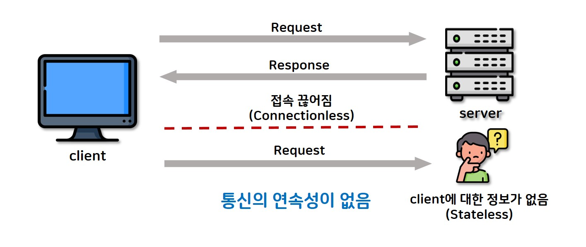

# Spring Scope

--- 

## 스프링 빈 스코프 종류

- Singleton Scope
- Prototype Scope
- Thread Scope
- Web Scope
  - Application Scope
  - Session Scope
  - Request Scope
  - Websocket Scope


| Scope       | Description                                              |
|-------------|----------------------------------------------------------|
| singleton   | (기본값) 스프링 IoC 컨테이너당 하나의 인스턴스 사용, 앱이 동작하는 동안 하나의 인스턴스만 사용 |
| prototype   | 매번 새로운 빈을 정의하여 사용                                        |
| request     | HTTP 라이프 사이클마다 하나의 빈을 사용                                 |
| session     | HTTP 세션마다 하나의 빈을 사용                                      |
| application | Servlet context 라이프사이클 동안 하나의 빈을 사용                      |
| webSocket   | webSocket 라이프사이클 안에서 하나의 빈을 사용                           |

- application, session, request 는 웹 환경에서만 사용할 수 있는 스코프입니다.

<br>

--- 

## Spring 에서 Bean 은 무엇일까?

개발자가 직접 관리하는 객체가 아닌 스프링 프레임워크에서 관리하는 객체를 `Bean` 이라고 부른다.

여기서 관리한다는 것은 어떤 것을 의미할까?

기본적으로 `Bean` 객체의 라이프 사이클을 관리한다. 

> **Bean 객체의 라이프 사이클**
>
> 스프링 컨테이너 생성 > 스프링 빈 생성 > 의존성 주입 > 빈 초기화 (초기화 콜백 함수 실행) > 사용 > 소멸 전 콜백 함수 실행 > 스프링 종료 (빈 소멸)

<br>

이러한 라이프사이클부터 로깅, 트랜잭션을 스프링 컨테이너에서 대신 관리해주기 때문에 우리가 따로 특별한 조치를 취하지 않고 `@Controller`, `@Service`, `@Component` 와 같은 어노테이션만으로 편하게 구현할 수 있는 것이다.

하지만 스프링의 기본적인 관리를 벗어나는 방법이 필요하다면 설정을 변경해서 직접 관리해야하는 일이 생기기 마련이다.

때문에 개발자는 스프링의 컨테이너가 어떤 식으로 동작하는지, 어떤 옵션을 제공하는지, 어떤 옵션을 커스터마이징하기 위해서는 어떤 부분을 살펴봐야하는지 관심을 가져야 한다.

<br>

--- 

### Singleton Scope

Spring Bean 의 가장 기본적인 Scope 는 Singleton 이다. 

디자인 패턴의 Singleton 처럼 단 하나의 객체만 존재하여 해당 객체를 사용하지만 Singleton 을 구현하는 방법에서 약간의 차이가 있다.

> **왜 스프링의 기본 Scope 는 Singleton 인가?**
>
> 스프링은 대규모 엔터프라이즈 서버환경을 대상으로 설계된 경량화 프레임워크이다. 서버 하나로 대규모 트래픽을 처리할 수 있는 높은 성능이 요구되었다.
> 때문에 클라이언트에서 요청이 올 때마다 각 로직을 담당하는 객체를 새로 만들어서 사용한다면 서버에 무리가 가기 때문에 Singleton 패턴을 이용하게 되었다.

<br>

Singleton Scope 의 빈 객체는 해당 빈 객체를 관리하는 스프링 컨테이너와 라이프사이클을 함께 한다. 

스프링 어플리케이션의 실행과 함께 생성되며 스프링 어플리케이션의 종료와 함께 빈은 소멸한다. 

생성된 인스턴스는 single beans cache 에 저장되고, 해당 bean 에 대한 요청과 참조가 있으면 캐싱되어 있는 객체를 사용한다.

<br>

`무엇을 Singleton Scope 로 사용해야 하는가?`

| 적합한 빈 객체 | 이유                                       |
|----------|------------------------------------------|
| 유틸리티 클래스 | 전역적으로 공유되는 유틸리티는 Singleton으로 적합          |
| 서비스 클래스  | 애플리케이션 전체에서 공유되는 비즈니스 로직은 Singleton으로 적합 |
| 캐시 클래스   | 데이터를 저장하고 공유하는 데에 사용되며 Singleton으로 적합    |

| 적합하지 않은 빈 객체 | 이유                                            |
|--------------|-----------------------------------------------|
| 상태를 가지는 객체   | 공유 상태가 동시성 문제를 야기할 수 있으므로 주의가 필요              |
| 데이터베이스 연결 객체 | 데이터베이스 연결은 스레드마다 고유해야 하므로 Singleton으로 적합하지 않음 |
| 요청마다 변경되는 객체 | Prototype 스코프를 사용하여 매 요청마다 새로운 인스턴스를 생성해야 함   |

<br>

### Prototype Scope

프로토타입 빈 스코프는 스프링 컨테이너가 생성, 의존성 주입, 초기화까지만 관리합니다. 

`주요 사용 사례`

- 매 요청마다 새로운 상태를 가진 객체가 필요한 경우
- 매 요청마다 의존성을 가진 독립적인 객체를 사용해야 하는 경우
- 캐시나 ThreadPool 과 같이 여러 인스턴스를 동적으로 생성해야 하는 경우 

`사용 시 주의사항`

기본적인 Controller, Service, Repository 등 레이어가 싱글톤 스코프의 빈 객체이기 때문에 함께 사용하게 된다.

이 때 기존 사용하던 것처럼 싱글톤 빈 객체에 프로토타입을 주입하여 사용하게 될텐데 이렇게 된다면 프로토타입 스코프처럼 동작하지 않는다.

싱글톤 스코프의 빈에 주입된 프로토타입 스코프의 빈 객체는 매번 바뀌지 않고 싱글톤 빈에 주입된 채로 그대로 사용됩니다. 

`해결 방안`

- proxy mode 이용

```Java
@Component
@Scope(value = "prototype", proxyMode = ScopedProxyMode.TARGET_CLASS)
public class PrototypeBean {
 // ApplicationContext 에서 빈을 처음 생성할 때 proxy 클래스를 만들어 빈으로 등록
 // proxy 클래스에서 내부적으로 새로운 prototype 빈을 사용하도록 설계 
}
```

- DL (Dependency Lookup) 과 Provider 이용

```Java
@Component
public class SingletonBean {
  
  private final ObjectProvider<ProtoTypeBean> objectProvider;
  
  public SingletonBean(ObjectProvider<ProtoTypeBean> objectProvider) {
    this.objectProvider = objectProvider;
  }
  
  public ProtoType getProtoType() {
    return objectProvider.getIfAvailable();
  }
}
```

- JSR-330 Provider 사용

```Java
build.gradle 

dependencies {
  implementation 'javax.inject:javax.inject:1' // 프로바이더 사용을 위한 의존성
}

@Component
public class SingletonBean {
  // 자바 표준이고, 기능이 단순하여 단위 테스트를 만들기 쉬움

  private final Provider<PrototypeBean> provider;
  
  public SingletonBean(Provider<PrototypeBean> provider) {
    this.provider = provider;
  }
  
  public int test(){
    PrototypeBean prototypeBean = provider.get();
    prototypeBean.addCount();
    
    return prototypeBean.getCount();
  }
}
```

## Web Scope

|       | ServletContext    | HttpSession    | HttpServletRequest |
|-------|-------------------|----------------|--------------------|
| 범위    | Application Scope | Session Scope  | Request Scope      |
| 생성    | 서버 시작 시           | 클라이언트가 최초 접속 시 | 클라이언트가 요청 시        |
| 제거    | 서버 종료 시           | 클라이언트가 접속 종료 시 | 서버가 응답 시           |
| 생명 주기 | 어플리케이션이 서비스중일 떄   | 클라이언트가 접속중일 때  | HTTP 요청이 응답보내기까지   |

### Application Scope

`ServletContext` 와 동일한 생명 주기를 가지는 스코프 

어플리케이션이 동작하는 동안 공통적으로 사용되는 정보, 상태를 처리하기 위해 생성되는 객체. 그 객체가 유지되는 범위를 말한다.

어플리케이션의 설정 정보, 캐시 데이터 등이 Application Scope 에서 관리되며 각 서비스에서 해당 객체를 통해서 이러한 정보들을 사용한다.  

### Session Scope

HTTP Session 과 동일한 생명 주기를 가지는 스코프

> **세션이란**
> 
> 기본적으로 HTTP 프로토콜은 stateless 한 특성을 가지고 있어 클라이언트가 보내는 요청에 대해 동일한 클라이언트라는 것을 알 수 없다.
> 때문에 이를 보완하고자 SessionID 를 쿠키를 통해 부여한다. 이후 요청에 서버로 부터 발급받은 쿠키를 함께 보내 이미 인증된 유저라는 것을 인식시킨다.



클라이언트에 대한 정보들 (로그인 상태, 사용자의 환경 설정 ...) 을 Session Scope 에 저장해두고 사용한다.

또한, 보안을 위해 세션에 유지 기한을 정해두고 기한이 지나면 해당 객체와 정보들을 소멸한다. 

<br>

### Request Scope

HTTP 요청이 하나 들어오고 나갈 때까지 유지되는 스코프, 각 HTTP 요청마다 별도의 빈 인스턴스가 생성되고 관리된다.

### Websocket Scope

웹 소켓과 동일한 생명 주기를 가지는 스코프.

주로 실시간 통신이 필요한 웹 어플리케이션에서 클라이언트와 서버가 연결된 상태와 정보들을 저장하기 위해 사용됩니다.

### Custom Scope

어떠한 정보를 Application, Session, Request, Websocket 이 아닌 어떠한 주기로 저장해두었다가 사용하고 싶다면 커스터마이징해서 사용할 수도 있다.

--- 


## 참고
> [Spring 공식문서 - bean scope](https://docs.spring.io/spring-framework/reference/core/beans/factory-scopes.html)
>
> [스프링 빈 생명주기 관련](https://dev-coco.tistory.com/170)
> 
> [스프링은 빈을 왜 싱글톤으로 생성할까?](https://velog.io/@minwest/Spring-%EC%8A%A4%ED%94%84%EB%A7%81%EC%9D%80-%EB%B9%88%EC%9D%84-%EC%99%9C-%EC%8B%B1%EA%B8%80%ED%86%A4%EC%9C%BC%EB%A1%9C-%EC%83%9D%EC%84%B1%ED%95%A0%EA%B9%8C)
> 
> [세션 관련](https://velog.io/@beneficial/Session%EC%9D%B4%EB%9E%80-%EB%AC%B4%EC%97%87%EC%9D%B8%EA%B0%80)
> 
> [스프링 빈 스코프 관련](https://0soo.tistory.com/225)
> 
> [스프링 웹 스코프 관련](https://rlaehddnd0422.tistory.com/35)
> 
> [커스텀 스코프 관련](https://pplenty.tistory.com/14)
> 
> [스프링 비동기 작업 관련](https://xxeol.tistory.com/44)
