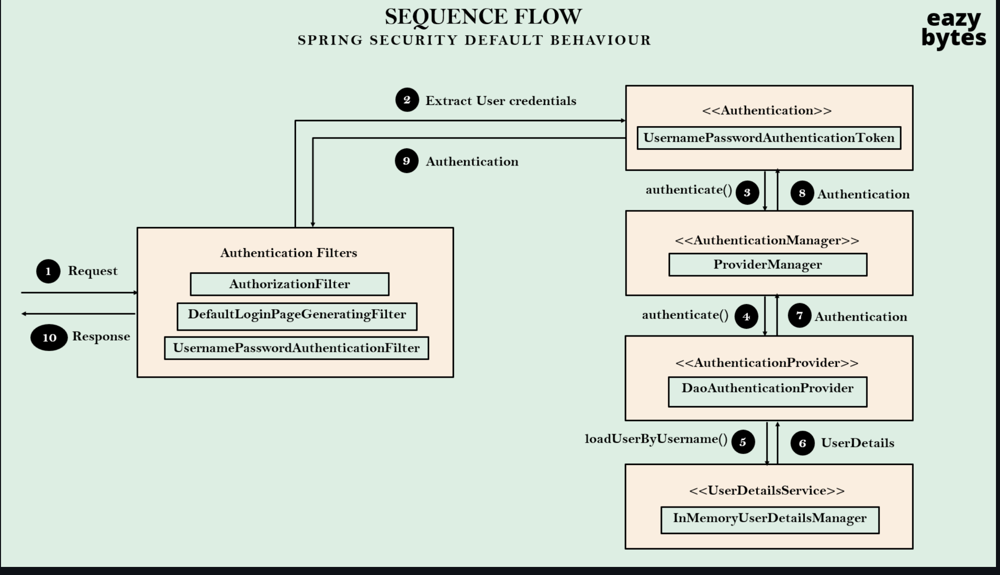
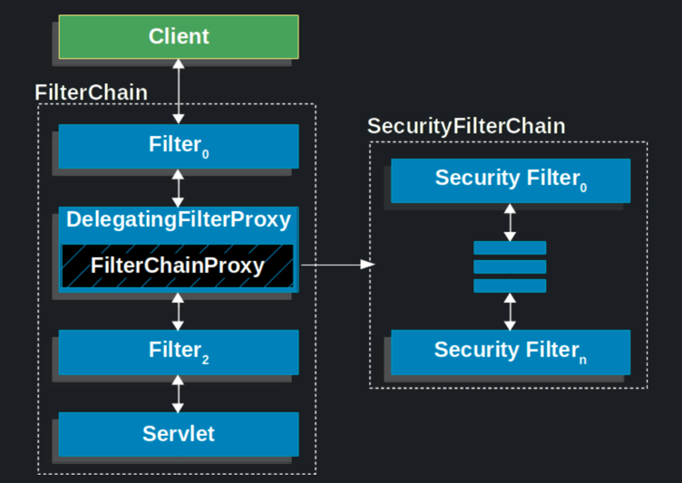

### Spring security란?
- Spring Security는 Java 애플리케이션에 인증과 권한 부여를 모두 제공하는 데 중점을 둔 프레임워크입니다.

### Spring security 사용이유
- 인증과 인가를 적용하는 과정에 필요한 보안에 관련한 기능 을 직접 구현하는 것보다 보안개발자들이 만들어둔 스프링 프레임워크를 사용하는 것이 훨씬 효율적이기 때문이라 생각합니다.

### Spring security sequence flow

1) http 요청
2) 인증 인가 처리
3) 유저 세부정보 접근 & 처리
4) http 반환

### Authentication Filters이해를 돕기위한 참고자료

## 권장 학습방법
- spring security6 dependency 주입후 위 사진의 sequnce flow 따라가기

### UserDetailService에서 사용자의 정보에 접근하는 방식의 이해를 돕기위한 다이어그램

- UserService는 유저세부정보를 얻는 메서드 하나만 존재
- UserDetailManager는 유저정보에 접근및 수정 모든 메서드 존재
- 마지막 계층은 구현체 ex)인메모리에 담을 것인지, DB랑 연동할것인지 ..

## 추가로 학습하면 좋을 것들
- Security Filter Chain에 JWT Token검증 필터 연동및 추가하기
  - Servlet(Filter, OncePerRequestFilter)
  - JWT
- Ouath2 Protocal
  - [OAUTH2 공식문서](https://oauth.net/2/)
- CORS, CSRF